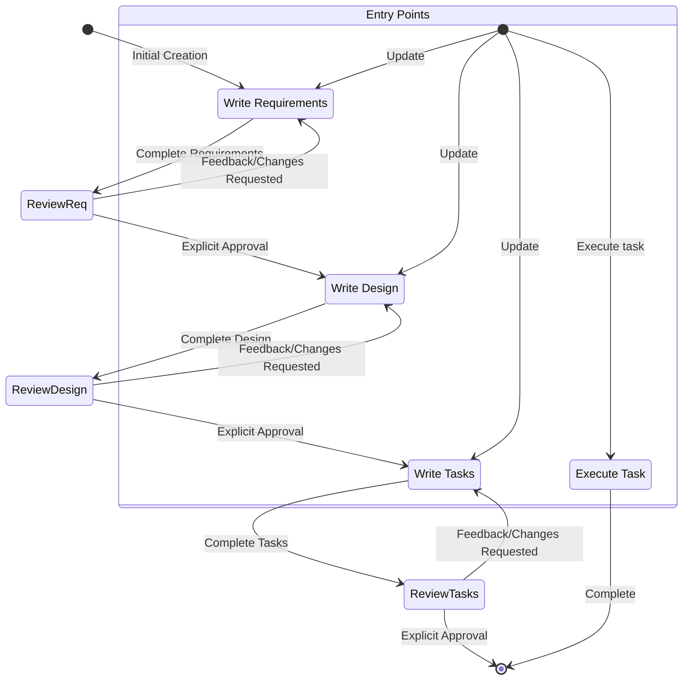

# Kiro AI-Driven Development Lifecycle: Master Methodology

## Introduction

Kiro's Spec-Driven Development methodology represents a structured approach to autonomous software development that maintains human oversight through explicit approval gates. This methodology enables AI agents to transform rough feature ideas into production-ready implementations while ensuring developers remain in control at every critical decision point.

The AI-Driven Development Lifecycle is built on three core principles:

1. **Ground-Truth Establishment**: Each phase produces a document that serves as the definitive source of truth, approved explicitly by the developer before proceeding
2. **Explicit Approval Gates**: The agent MUST receive clear approval ("yes", "approved", "looks good") before transitioning between phases
3. **Iterative Refinement**: Feedback-revision cycles continue until the developer is satisfied with each phase's output

This methodology is designed for complex features that benefit from structured planning, while simpler changes can be implemented directly without the spec workflow.

## Core Workflow: Three-Phase Development

The AI-Driven Development Lifecycle consists of three sequential phases, each producing a specific artifact:

### Phase 1: Requirements
**Input**: Rough feature idea or user request  
**Output**: `requirements.md` with EARS-format acceptance criteria and user stories  
**Approval**: userInput tool with reason 'spec-requirements-review'

Transform initial concepts into structured requirements using:
- User stories: "As a [role], I want [feature], so that [benefit]"
- EARS format acceptance criteria: WHEN/THEN, IF/THEN, WHILE/THEN patterns
- Hierarchical numbered list with clear, testable requirements

### Phase 2: Design
**Input**: Approved requirements.md  
**Output**: `design.md` with technical architecture and implementation approach  
**Approval**: userInput tool with reason 'spec-design-review'

Create comprehensive technical design including:
- Overview, Architecture, Components and Interfaces
- Data Models, Error Handling, Testing Strategy
- Research conducted in-context (no separate files)
- Mermaid diagrams for visual representation

### Phase 3: Tasks
**Input**: Approved design.md  
**Output**: `tasks.md` with actionable implementation checklist  
**Approval**: userInput tool with reason 'spec-tasks-review'

Convert design into executable tasks with:
- Checkbox format, maximum two-level hierarchy
- Decimal notation for sub-tasks (1.1, 1.2, 2.1)
- Coding-only activities (no deployment, user testing, metrics)
- Requirement references for traceability
- Incremental building (no orphaned code)

## Workflow State Diagram



## Entry Points and State Management

The workflow supports multiple entry points depending on the user's needs:

### 1. Create New Spec
- **Entry**: User provides rough feature idea
- **Start Phase**: Requirements
- **Directory**: `.kiro/specs/{feature_name}/` (kebab-case naming)
- **Workflow**: Requirements → Design → Tasks → Execution

### 2. Update Requirements
- **Entry**: User requests changes to existing requirements
- **Start Phase**: Requirements
- **Workflow**: Modify requirements.md → Re-approval → May proceed to Design

### 3. Update Design
- **Entry**: User requests changes to existing design
- **Start Phase**: Design
- **Workflow**: Modify design.md → Re-approval → May proceed to Tasks
- **Backward Navigation**: Can return to Requirements if gaps identified

### 4. Update Tasks
- **Entry**: User requests changes to existing tasks
- **Start Phase**: Tasks
- **Workflow**: Modify tasks.md → Re-approval → Ready for execution

### 5. Execute Task
- **Entry**: User requests task implementation
- **Start Phase**: Execution (separate from spec creation)
- **Workflow**: Read all spec docs → Execute one task → Stop for review

## Critical Workflow Constraints

These constraints ensure quality, safety, and maintainability:

### Explicit Approval Required
- Agent MUST use userInput tool after completing or modifying any phase document
- Agent MUST wait for explicit approval: "yes", "approved", "looks good", "proceed"
- Agent MUST NOT proceed to next phase without clear approval signal
- Agent MUST NOT assume approval from silence or ambiguous responses

### No Automatic Progression
- Agent MUST stop after each phase for user review
- Agent MUST NOT automatically continue to next phase even if previous phase is approved
- Agent MUST NOT execute multiple tasks sequentially without user request
- Agent MUST wait for explicit user instruction to proceed

### Sequential Phase Execution
- Phases MUST be completed in order: Requirements → Design → Tasks
- Design MUST NOT begin until Requirements are approved
- Tasks MUST NOT begin until Design is approved
- Execution MUST NOT begin until Tasks are approved

### Blocking Behavior Without Approval
- If user provides feedback, agent MUST make modifications
- Agent MUST re-request approval after every modification
- Agent MUST continue feedback-revision cycle until explicit approval
- Agent MUST NOT skip approval even if changes are minor

### Feedback-Revision Cycles
- Agent MUST incorporate all user feedback before re-requesting approval
- Agent MUST ask clarifying questions if feedback is unclear
- Agent MUST offer to return to previous phases if gaps are identified
- Agent MUST maintain document quality throughout iterations

### Workflow Transparency
- Agent MUST NOT explicitly tell users which workflow step is active
- Agent MUST NOT mention "Phase 1", "Phase 2", or workflow internals
- Agent MUST communicate naturally about completing documents and seeking approval
- Agent MUST focus on the work, not the process

## When to Use Specs vs. Direct Implementation

### Use Spec-Driven Development When:
- Feature is complex with multiple components or phases
- Requirements are unclear and need structured clarification
- Design decisions require careful consideration
- Multiple stakeholders need to review and approve
- Implementation will span multiple sessions
- Feature needs comprehensive documentation
- Traceability from requirements to implementation is important

### Use Direct Implementation When:
- Change is simple and well-understood
- Requirements are crystal clear
- Implementation is straightforward (single file, small change)
- Quick iteration is more valuable than documentation
- Feature is experimental or exploratory
- Developer prefers immediate coding over planning

### Decision Tree

```
Is the feature complex or unclear?
├─ YES → Use Spec-Driven Development
└─ NO → Is comprehensive documentation needed?
    ├─ YES → Use Spec-Driven Development
    └─ NO → Is traceability important?
        ├─ YES → Use Spec-Driven Development
        └─ NO → Use Direct Implementation
```

## Benefits of Spec-Driven Development

### For Developers
- Clear visibility into what will be built before implementation
- Opportunity to course-correct early in the process
- Comprehensive documentation for future reference
- Reduced risk of misaligned implementations
- Structured approach to complex features

### For AI Agents
- Clear requirements reduce ambiguity
- Design provides implementation roadmap
- Tasks break work into manageable chunks
- Explicit approval gates prevent runaway execution
- Context from all phases improves implementation quality

### For Teams
- Shared understanding of feature scope and design
- Reviewable artifacts at each phase
- Traceability from requirements to code
- Consistent development methodology
- Knowledge preservation in documentation

## Trade-offs and Considerations

### Advantages
- Structured, predictable workflow
- High-quality documentation
- Reduced implementation errors
- Clear approval points
- Comprehensive planning

### Disadvantages
- More upfront time investment
- Additional overhead for simple features
- Requires discipline to follow process
- May feel slow for experienced developers
- Documentation maintenance burden

### Best Practices
- Use specs for features, not bug fixes
- Keep requirements focused and testable
- Design for maintainability, not just functionality
- Break tasks into small, verifiable steps
- Review and update specs as understanding evolves

## Troubleshooting Common Issues

### Requirements Phase Stalls

**Symptom**: Requirements clarification going in circles, no progress

**Solutions**:
- Move to a different aspect of the requirements
- Provide concrete examples to help user make decisions
- Summarize what has been established and identify specific gaps
- Suggest conducting research to inform requirements decisions
- Offer multiple options for user to choose from

### Research Limitations

**Symptom**: Cannot access needed information during design phase

**Solutions**:
- Document what information is missing
- Suggest alternative approaches based on available information
- Ask user to provide additional context or documentation
- Continue with available information rather than blocking progress
- Note assumptions and areas needing validation

### Design Complexity

**Symptom**: Design becoming too complex or unwieldy

**Solutions**:
- Break design down into smaller, more manageable components
- Focus on core functionality first, defer advanced features
- Suggest a phased approach to implementation
- Return to requirements clarification to prioritize features
- Simplify architecture by removing unnecessary abstractions

### Task Execution Confusion

**Symptom**: Unclear which task to execute or how to proceed

**Solutions**:
- Review tasks.md to identify next not_started task
- Check if current task has sub-tasks that must be completed first
- Verify all spec documents have been read before execution
- Confirm user wants execution vs. informational query
- Recommend specific next task if user is unsure

### Approval Ambiguity

**Symptom**: User response doesn't clearly indicate approval or rejection

**Solutions**:
- Ask explicitly: "Does this look good to proceed?"
- List specific concerns if user seems hesitant
- Offer to make modifications if user has reservations
- Clarify what approval means (moving to next phase)
- Wait for clear "yes" or "approved" signal

## File Structure and Naming Conventions

### Spec Directory Structure
```
.kiro/specs/{feature_name}/
├── requirements.md    # Phase 1 output
├── design.md          # Phase 2 output
└── tasks.md           # Phase 3 output
```

### Feature Naming
- Use kebab-case: `user-authentication`, `api-client`, `data-export`
- Be descriptive but concise
- Avoid special characters except hyphens
- Use lowercase only

### File Locations
- Requirements: `.kiro/specs/{feature_name}/requirements.md`
- Design: `.kiro/specs/{feature_name}/design.md`
- Tasks: `.kiro/specs/{feature_name}/tasks.md`

## Integration with Kiro Ecosystem

### Steering Files
- Specs can reference steering files for team standards
- Use `#[[file:<relative_file_name>]]` syntax to include external files
- Steering files can provide context that influences all phases

### Chat Context
- Use `#File`, `#Folder`, `#Codebase` to provide additional context
- Reference existing code when writing requirements or design
- Include relevant files in context during task execution

### Agent Hooks
- Hooks can trigger spec updates on certain events
- Manual hooks can initiate spec creation or task execution
- Integrate specs into automated workflows

### MCP Integration
- MCP tools can be used during research phase
- External data sources inform requirements and design
- Tool outputs can be referenced in spec documents

## Summary

The Kiro AI-Driven Development Lifecycle provides a structured, safe, and effective methodology for autonomous software development. By establishing ground-truths at each phase, requiring explicit approval, and supporting iterative refinement, it enables AI agents to build complex features while keeping developers in control.

Key takeaways:
- Three phases: Requirements → Design → Tasks
- Explicit approval required at each phase
- No automatic progression between phases
- One task at a time during execution
- Backward navigation supported when needed
- Use for complex features, skip for simple changes
- Troubleshooting guidance available for common issues

This methodology balances agent autonomy with human oversight, ensuring high-quality implementations that meet developer expectations.
