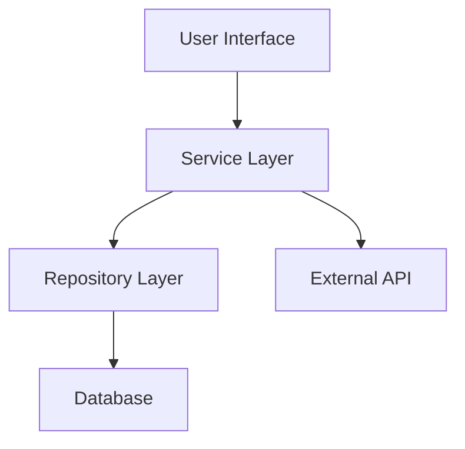
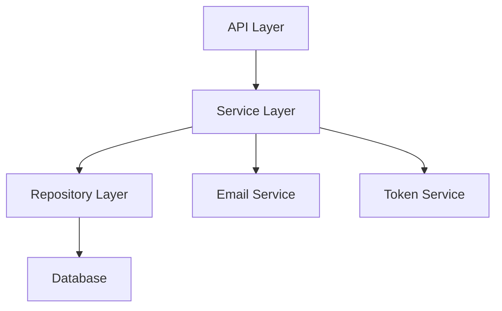

# Design Phase Guide

The Design phase transforms approved requirements into comprehensive technical designs. This phase involves research, architectural decisions, and detailed planning that will guide implementation.

## Phase Overview

After requirements are approved, you'll create a design document that addresses every requirement with concrete technical solutions. The design phase is where you:

- Conduct research to inform technical decisions
- Define system architecture and component interactions
- Specify data models and interfaces
- Plan error handling and testing strategies
- Make and document design decisions

The design document lives at `.kiro/specs/{feature_name}/design.md` and serves as the technical blueprint for implementation.

## Research and Context Building

Research happens in-context during the design phase. You don't create separate research files - instead, you:

- Identify areas needing research based on requirements
- Conduct research and build up context in the conversation
- Summarize key findings that inform the design
- Cite sources and include relevant links in the conversation
- Incorporate research findings directly into the design document

This approach keeps research integrated with design decisions, making it clear why specific technical choices were made.

## Required Design Sections

Every design document must include these sections:

### Overview

Provide a high-level summary of the feature and the design approach. Explain what the feature does, how it fits into the larger system, and the key design principles guiding the implementation.

### Architecture

Describe the overall system architecture. Include:

- Component organization and relationships
- Data flow between components
- External dependencies and integrations
- Architectural patterns being used

Use Mermaid diagrams to visualize architecture when helpful.

### Components and Interfaces

Detail each component that will be implemented:

- Component responsibilities and boundaries
- Public interfaces and APIs
- Dependencies between components
- Key methods or functions

### Data Models

Specify all data structures, types, and models:

- Entity definitions
- Relationships between entities
- Validation rules
- Data transformations

Use TypeScript interfaces, class diagrams, or similar representations to make models concrete.

### Error Handling

Plan how errors will be handled:

- Error types and categories
- Error propagation strategy
- User-facing error messages
- Logging and debugging approach

### Testing Strategy

Outline how the implementation will be tested:

- Unit testing approach
- Integration testing needs
- Test-driven development opportunities
- Edge cases to cover

## Using Mermaid Diagrams

Mermaid diagrams help visualize complex designs. Use them for:

- Architecture diagrams (component relationships)
- Sequence diagrams (interaction flows)
- State diagrams (state machines)
- Class diagrams (data models)

Example architecture diagram:



Keep diagrams focused on one concept and include text descriptions for accessibility.

## Design Decision Documentation

Document important design decisions and their rationales. Explain:

- What alternatives were considered
- Why the chosen approach was selected
- Trade-offs involved
- Assumptions being made

This helps reviewers understand your thinking and provides context for future changes.

## File Location and Structure

Create the design document at:

```
.kiro/specs/{feature_name}/design.md
```

Use the feature name in kebab-case (e.g., `user-authentication`, `api-client`).

## Review and Approval Process

After creating or updating the design document:

1. The agent asks: "Does the design look good? If so, we can move on to the implementation plan."
2. This question is asked using the `userInput` tool with reason `spec-design-review`
3. You review the design and provide feedback or approval
4. If you request changes, the agent makes modifications and asks for approval again
5. This feedback-revision cycle continues until you explicitly approve
6. Only after explicit approval (like "yes", "approved", "looks good") does the workflow proceed to the Tasks phase

Explicit approval is required - the agent will not proceed without it.

## Backward Navigation

If gaps are identified during design, the agent can return to the Requirements phase to clarify or add requirements. This ensures the design has a solid foundation.

## Addressing Requirements

The design must address all requirements from the requirements document. Each design section should clearly connect to specific requirements, showing how the technical approach satisfies what was specified.

## Example Design Document

Here's a complete example for a user authentication feature:

---

**design.md**

```markdown
# Design Document: User Authentication System

## Overview

This design outlines a secure user authentication system with email/password login, session management, and password reset functionality. The system follows industry best practices for security, including password hashing with bcrypt, secure session tokens, and rate limiting to prevent brute force attacks.

The authentication system will be implemented as a standalone module that can be integrated into the existing application architecture. It will expose a clean API for registration, login, logout, and password management operations.

## Architecture

The authentication system consists of four main layers:



- **API Layer**: Handles HTTP requests, input validation, and response formatting
- **Service Layer**: Contains business logic for authentication operations
- **Repository Layer**: Manages data persistence and retrieval
- **Database**: Stores user credentials and session data
- **Email Service**: Sends password reset emails
- **Token Service**: Generates and validates session tokens

This layered architecture provides clear separation of concerns and makes the system testable and maintainable.

## Components and Interfaces

### AuthController (API Layer)

Handles authentication-related HTTP endpoints.

```typescript
interface AuthController {
  register(req: Request, res: Response): Promise<Response>;
  login(req: Request, res: Response): Promise<Response>;
  logout(req: Request, res: Response): Promise<Response>;
  requestPasswordReset(req: Request, res: Response): Promise<Response>;
  resetPassword(req: Request, res: Response): Promise<Response>;
}
```

### AuthService (Service Layer)

Contains core authentication business logic.

```typescript
interface AuthService {
  registerUser(email: string, password: string): Promise<User>;
  authenticateUser(email: string, password: string): Promise<SessionToken>;
  invalidateSession(token: string): Promise<void>;
  initiatePasswordReset(email: string): Promise<void>;
  completePasswordReset(token: string, newPassword: string): Promise<void>;
}
```

### UserRepository (Repository Layer)

Manages user data persistence.

```typescript
interface UserRepository {
  create(user: User): Promise<User>;
  findByEmail(email: string): Promise<User | null>;
  findById(id: string): Promise<User | null>;
  updatePassword(userId: string, hashedPassword: string): Promise<void>;
}
```

### TokenService

Handles session token generation and validation.

```typescript
interface TokenService {
  generateSessionToken(userId: string): Promise<string>;
  validateToken(token: string): Promise<{ userId: string; valid: boolean }>;
  revokeToken(token: string): Promise<void>;
}
```

## Data Models

### User

```typescript
interface User {
  id: string;
  email: string;
  passwordHash: string;
  createdAt: Date;
  updatedAt: Date;
}
```

Validation rules:
- Email must be valid format and unique
- Password must be at least 8 characters with uppercase, lowercase, and number
- Password is hashed with bcrypt (cost factor 12) before storage

### SessionToken

```typescript
interface SessionToken {
  token: string;
  userId: string;
  expiresAt: Date;
  createdAt: Date;
}
```

Validation rules:
- Tokens are cryptographically random (32 bytes)
- Tokens expire after 24 hours
- Expired tokens are automatically cleaned up

### PasswordResetToken

```typescript
interface PasswordResetToken {
  token: string;
  userId: string;
  expiresAt: Date;
  used: boolean;
}
```

Validation rules:
- Reset tokens expire after 1 hour
- Tokens can only be used once
- Tokens are invalidated after password change

## Error Handling

### Error Categories

1. **Validation Errors** (400): Invalid input format or missing required fields
2. **Authentication Errors** (401): Invalid credentials or expired session
3. **Authorization Errors** (403): Insufficient permissions
4. **Not Found Errors** (404): User or resource doesn't exist
5. **Rate Limit Errors** (429): Too many requests
6. **Server Errors** (500): Unexpected system failures

### Error Response Format

```typescript
interface ErrorResponse {
  error: {
    code: string;
    message: string;
    details?: any;
  };
}
```

### Error Handling Strategy

- All errors are caught at the API layer and converted to appropriate HTTP responses
- Sensitive information (like "user exists") is not leaked in error messages
- Failed login attempts are logged for security monitoring
- Rate limiting prevents brute force attacks (5 attempts per 15 minutes per IP)

### Logging

- All authentication events (login, logout, password reset) are logged
- Failed authentication attempts include IP address and timestamp
- Logs exclude sensitive data (passwords, tokens)

## Testing Strategy

### Unit Tests

- Test each service method in isolation with mocked dependencies
- Test password hashing and validation logic
- Test token generation and validation
- Test error handling for all edge cases

### Integration Tests

- Test complete authentication flows (register → login → logout)
- Test password reset flow end-to-end
- Test rate limiting behavior
- Test session expiration handling

### Test-Driven Development

Implement in this order to enable early testing:

1. Data models with validation
2. Repository layer with in-memory implementation
3. Service layer with unit tests
4. API layer with integration tests

### Edge Cases to Cover

- Duplicate email registration attempts
- Login with non-existent user
- Login with incorrect password
- Using expired session token
- Using expired password reset token
- Concurrent login attempts
- Password reset for non-existent user
- Rate limit boundary conditions

## Design Decisions

### Password Hashing: bcrypt

**Decision**: Use bcrypt with cost factor 12 for password hashing.

**Rationale**: bcrypt is industry-standard, resistant to rainbow table attacks, and the cost factor can be increased as hardware improves. Cost factor 12 provides good security while maintaining acceptable performance (~250ms per hash).

**Alternatives Considered**: argon2 (more modern but less widely supported), PBKDF2 (older, less resistant to GPU attacks)

### Session Management: Token-based

**Decision**: Use cryptographically random tokens stored in database.

**Rationale**: Provides flexibility for multi-device sessions, easy revocation, and works well with stateless API architecture.

**Alternatives Considered**: JWT (harder to revoke), server-side sessions (doesn't scale horizontally)

### Rate Limiting: IP-based

**Decision**: Limit failed login attempts by IP address (5 attempts per 15 minutes).

**Rationale**: Prevents brute force attacks while minimizing impact on legitimate users. IP-based is simple and effective for most scenarios.

**Alternatives Considered**: Account-based limiting (vulnerable to account enumeration), CAPTCHA (poor UX)

</content>
</invoke>
### 
Email Service: Third-party Provider

**Decision**: Use a third-party email service (SendGrid/Mailgun) for password reset emails.

**Rationale**: Reliable delivery, handles spam filtering, provides analytics, and avoids managing SMTP infrastructure.

**Alternatives Considered**: Self-hosted SMTP (maintenance burden, deliverability issues), no email (poor UX for password reset)

## Assumptions

- Users have access to their email for password reset
- Application has HTTPS enabled for secure token transmission
- Database supports unique constraints on email field
- Email service API is available and reliable

---

This design addresses all requirements from the requirements document:

- **Requirement 1.1**: User registration with email/password (AuthService.registerUser)
- **Requirement 1.2**: Secure password storage (bcrypt hashing in User model)
- **Requirement 2.1**: User login with session management (AuthService.authenticateUser, TokenService)
- **Requirement 2.2**: Session expiration (SessionToken.expiresAt, 24-hour limit)
- **Requirement 3.1**: Password reset initiation (AuthService.initiatePasswordReset)
- **Requirement 3.2**: Password reset completion (AuthService.completePasswordReset)
- **Requirement 4.1**: Rate limiting (5 attempts per 15 minutes in error handling)
- **Requirement 4.2**: Security logging (authentication event logging)
```

---

## Tips for Writing Good Designs

### Start with the Big Picture

Begin with the Overview and Architecture sections to establish the overall approach before diving into details.

### Be Specific

Vague designs lead to implementation confusion. Specify exact data types, method signatures, and error codes.

### Show, Don't Just Tell

Use diagrams, code snippets, and examples to make abstract concepts concrete.

### Connect to Requirements

Explicitly reference requirements throughout the design. This ensures nothing is missed and helps reviewers verify completeness.

### Document Trade-offs

Every design involves trade-offs. Explaining them shows thoughtful decision-making and helps others understand the constraints.

### Think About Testing

A design that's hard to test is often a design that's hard to implement well. Plan for testability from the start.

### Keep It Maintainable

Consider how the design will evolve. Avoid tight coupling and plan for future changes.

## Common Pitfalls

### Insufficient Detail

Designs that are too high-level leave too many decisions for implementation time, leading to inconsistency and rework.

### Over-Engineering

Don't design for hypothetical future requirements. Focus on what's needed now, with room to extend later.

### Ignoring Non-Functional Requirements

Security, performance, and error handling are often afterthoughts. Address them explicitly in the design.

### Skipping Research

Jumping into design without understanding existing patterns, libraries, or constraints leads to suboptimal solutions.

### Not Validating Against Requirements

It's easy to drift from requirements during design. Regularly check that every requirement is addressed.

## Next Steps

After the design is approved, you'll move to the Tasks phase where the design is broken down into discrete, actionable implementation steps. The design document will be available as context during task execution, so you don't need to repeat all details in the task list.
