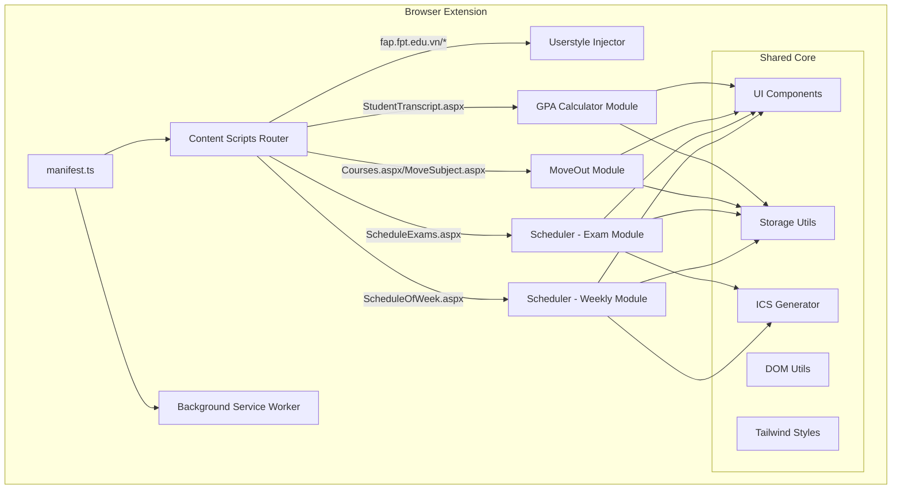
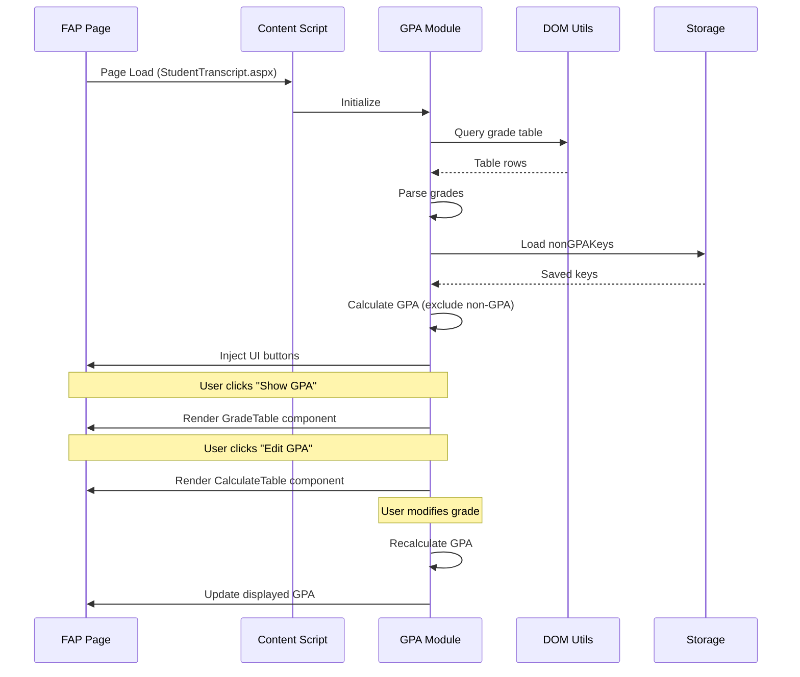
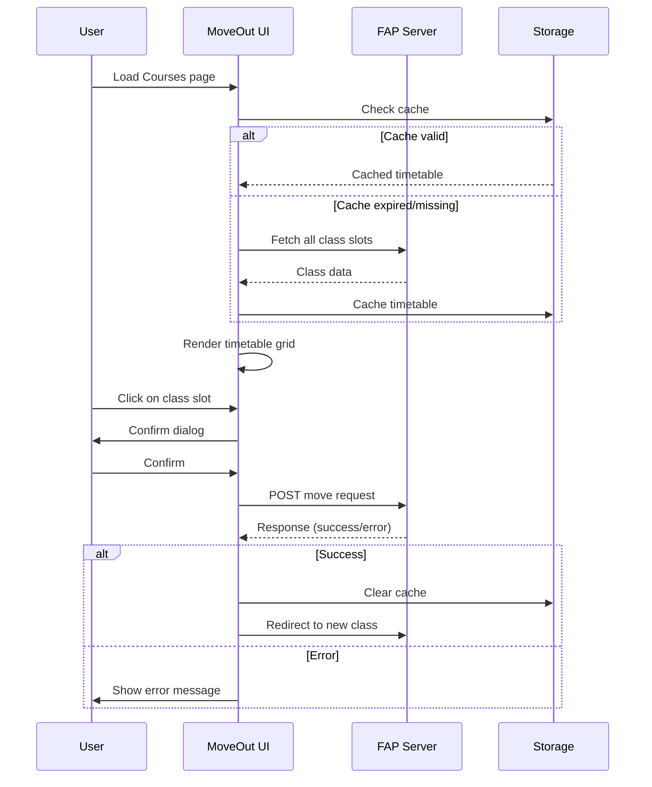
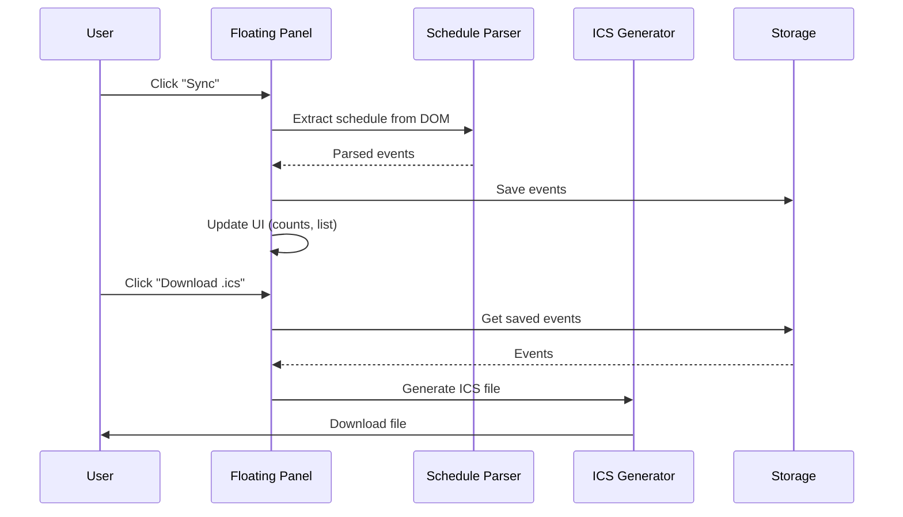

# Design Document: FAP-AIO Extension

## Overview

FAP-AIO is a merged browser extension that consolidates four separate FAP-related extensions into a unified codebase. The extension uses a modular architecture where each feature operates independently on its designated page(s) while sharing common infrastructure like styling, storage utilities, and UI components.

The design prioritizes:
- **Cross-browser compatibility**: Avoiding Chrome-exclusive APIs
- **Future-proofing**: Architecture that facilitates conversion to Tampermonkey userscript
- **Maintainability**: Clear separation of concerns with feature-based modules
- **Performance**: Lazy loading and page-specific content script injection

## Architecture

The extension follows a **feature-modular architecture** with a shared core layer:



### Directory Structure

```
fap-aio/
├── src/
│   ├── manifest.ts                 # Extension manifest configuration
│   ├── background/
│   │   └── index.ts               # Minimal service worker (future use)
│   │
│   ├── contentScript/
│   │   ├── index.ts               # Main entry - routes to features
│   │   ├── userstyle.ts           # CSS injection for all FAP pages
│   │   │
│   │   ├── features/
│   │   │   ├── gpa/
│   │   │   │   ├── index.tsx      # GPA feature entry
│   │   │   │   ├── App.tsx        # Main GPA component
│   │   │   │   ├── components/
│   │   │   │   │   ├── Header.tsx
│   │   │   │   │   ├── GradeTable.tsx
│   │   │   │   │   └── CalculateTable.tsx
│   │   │   │   └── utils.ts       # GPA-specific utilities
│   │   │   │
│   │   │   ├── moveout/
│   │   │   │   ├── index.tsx      # MoveOut feature entry
│   │   │   │   ├── App.tsx        # Main MoveOut component (class switching)
│   │   │   │   ├── RegisterCourse.tsx  # Course registration component
│   │   │   │   ├── components/
│   │   │   │   │   ├── Header.tsx
│   │   │   │   │   ├── Timetable.tsx
│   │   │   │   │   ├── FilterSection.tsx
│   │   │   │   │   ├── ClassListDetails.tsx
│   │   │   │   │   └── TimetableDetails.tsx
│   │   │   │   ├── constants/
│   │   │   │   │   ├── classData.ts
│   │   │   │   │   └── formData.ts
│   │   │   │   └── utils.ts
│   │   │   │
│   │   │   └── scheduler/
│   │   │       ├── index.ts       # Scheduler feature entry
│   │   │       ├── panel.ts       # Floating panel UI
│   │   │       ├── exam.ts        # Exam schedule logic
│   │   │       ├── weekly.ts      # Weekly schedule logic
│   │   │       ├── icsGenerator.ts
│   │   │       └── styles.ts      # Panel CSS-in-JS
│   │   │
│   │   └── shared/
│   │       ├── storage.ts         # localStorage wrapper
│   │       ├── dom.ts             # DOM utilities
│   │       ├── constants.ts       # Shared constants
│   │       └── types.ts           # Shared TypeScript types
│   │
│   ├── styles/
│   │   ├── userstyle.css          # FAP dark theme CSS
│   │   ├── tailwind.css           # Tailwind base imports
│   │   └── components.css         # Shared component styles
│   │
│   └── assets/
│       └── icons/                 # Extension icons
│
├── public/
│   └── img/                       # Static images
│
├── tailwind.config.js
├── postcss.config.js
├── vite.config.ts
├── tsconfig.json
└── package.json
```

## Components and Interfaces

### Content Script Router

The main content script entry point routes to appropriate feature modules based on URL:

```typescript
// src/contentScript/index.ts

interface PageMatcher {
  pattern: RegExp;
  handler: () => void;
}

const pageMatchers: PageMatcher[] = [
  { pattern: /.*/, handler: injectUserstyle },  // Always inject
  { pattern: /Grade\/StudentTranscript\.aspx/, handler: initGPA },
  { pattern: /FrontOffice\/(Courses|MoveSubject)\.aspx/, handler: initMoveOut },
  { pattern: /FrontOffice\/RegisterCourse\.aspx/, handler: initRegisterCourse },  // Course registration
  { pattern: /Exam\/ScheduleExams\.aspx/, handler: initExamScheduler },
  { pattern: /Report\/ScheduleOfWeek\.aspx/, handler: initWeeklyScheduler },
];
```

### Storage Interface

Unified storage abstraction for localStorage with namespacing:

```typescript
// src/contentScript/shared/storage.ts

interface StorageOptions {
  expiry?: number;  // TTL in milliseconds
}

interface StorageItem<T> {
  data: T;
  timestamp: number;
  expiry?: number;
}

const STORAGE_PREFIX = 'fap-aio:';

export const storage = {
  get<T>(key: string): T | null;
  set<T>(key: string, value: T, options?: StorageOptions): void;
  remove(key: string): void;
  clear(): void;  // Clears only fap-aio prefixed keys
  isExpired(key: string): boolean;
};
```

### Floating Panel Component

Reusable floating panel for scheduler features:

```typescript
// src/contentScript/features/scheduler/panel.ts

interface PanelConfig {
  id: string;
  title: string;
  tabs: PanelTab[];
  onClose?: () => void;
  onMinimize?: () => void;
  onReset?: () => void;
}

interface PanelTab {
  id: string;
  label: string;
  icon: string;
  content: () => HTMLElement;
}

class FloatingPanel {
  constructor(config: PanelConfig);
  show(): void;
  hide(): void;
  minimize(): void;
  restore(): void;
  updateTabCount(tabId: string, count: number): void;
  setProgress(current: number, total: number, label?: string): void;
  makeDraggable(): void;
}

// Toggle button (appears when panel is closed)
interface ToggleButton {
  show(): void;
  hide(): void;
  onClick(callback: () => void): void;
}

function showToggleButton(): void;  // Shows 📅 button in bottom-right corner
```

### ICS Generator

RFC 5545 compliant calendar file generator:

```typescript
// src/contentScript/features/scheduler/icsGenerator.ts

interface CalendarEvent {
  title: string;
  description?: string;
  location?: string;
  start: Date;
  end: Date;
  tag?: string;       // FE, PE, etc.
  meetUrl?: string;   // For online classes
}

export function generateICS(events: CalendarEvent[], filename: string): void;
export function formatICSDate(date: Date): string;
export function createEventUID(): string;
```

### GPA Module Interfaces

```typescript
// src/contentScript/features/gpa/types.ts

interface Subject {
  semester: string;
  code: string;
  name: string;
  credit: number;
  grade: number;
  status: 'Passed' | 'Not passed' | 'Studying' | 'Not started';
}

interface SemesterData {
  semester: string;
  year: string;
  data?: string;        // "Studying" | "Not started" for current semesters
  subjects: Subject[];
  gpa: number;
}

interface GPAConfig {
  nonGPAKeys: string[];  // Subject prefixes to exclude
}

// Default non-GPA subject prefixes (can be customized by user)
const DEFAULT_NON_GPA_KEYS = ["OJS", "VOV", "GDQP", "LAB", "ENT", "SSS", "TMI", "TRS", "OTP"];

// GPA label mapping for color coding
function mapGPALabel(subject: Subject | null, gpa?: number): string;
function mapSemesterLabel(semester: string): string;
```

### MoveOut Module Interfaces

```typescript
// src/contentScript/features/moveout/types.ts

interface ClassSlot {
  classId: string;
  lecturer: string;
  slot: string;       // "1" - "8"
  weekday: string;    // "Mon" - "Sun"
  studentCount?: number;
}

interface TimeTable {
  // Map<Weekday, Map<Slot, ClassSlot[]>>
  data: Map<string, Map<string, ClassSlot[]>>;
}

interface MoveOutFilter {
  lecturer: string;
  classId: string;
  studentCount: number;
  excludeSlots: string[];
  excludeWeekdays: string[];
}

// External JSON files fetched from GitHub Pages
interface MoveOutNotification {
  message: string;
  bg: string;        // CSS class for background
  version: string;   // Current extension version
}

// Fetched from: https://ruskicoder.github.io/fap-moveout/noti.json
// Fetched from: https://ruskicoder.github.io/fap-moveout/dept.json (department data)

// Class color generation (consistent colors per class)
function textToColor(text: string): string;

// Class list download utility
function handleDownload(classList: ClassSlot[], subject: string): void;
```

### MoveOut Constants

```typescript
// src/contentScript/features/moveout/constants/classData.ts

export const weekdays = ["Mon", "Tue", "Wed", "Thu", "Fri", "Sat", "Sun"];
export const slots = ["1", "2", "3", "4", "5", "6", "7", "8"];

// Lecturer review Google Sheet
export const LECTURER_REVIEW_URL = "https://docs.google.com/spreadsheets/d/1CTlmTC4RgW4zk-A9VTkz4BGzjY2PMk5s/edit";
```

### Scheduler Module Interfaces

```typescript
// src/contentScript/features/scheduler/types.ts

interface ExamEvent {
  title: string;
  location: string;
  description: string;
  start: Date;
  end: Date;
  tag: 'FE' | 'PE' | '2NDFE' | '2NDPE' | null;
  type: 'exam';
}

interface ClassEvent {
  title: string;
  location: string;
  description: string;
  start: Date;
  end: Date;
  meetUrl?: string;
  status: 'attended' | 'absent' | 'not-yet';
  slot: number;
  type: 'class';
  isOnline: boolean;
}

interface SemesterInfo {
  label: string;      // "Spring25"
  season: string;     // "Spring"
  year: number;       // 2025
  startDate: Date;
  endDate: Date;
}

// Slot timing constants (FPT standard)
const SLOT_TIMES: Record<number, { start: string; end: string }> = {
  1: { start: "7:00", end: "9:15" },
  2: { start: "9:30", end: "11:45" },
  3: { start: "12:30", end: "14:45" },
  4: { start: "15:00", end: "17:15" },
  5: { start: "17:30", end: "19:45" },
  6: { start: "20:00", end: "22:15" },
  7: { start: "7:00", end: "9:15" },   // Same as slot 1
  8: { start: "9:30", end: "11:45" }   // Same as slot 2
};

// ICS alarm configuration
const ICS_ALARMS = {
  exam: { trigger: '-P1D', description: '1 day before exam' },
  class: { trigger: '-PT15M', description: '15 minutes before class' }
};
```

## Data Models

### Storage Keys

| Key | Description | Expiry |
|-----|-------------|--------|
| `fap-aio:gpa:nonGPAKeys` | Custom non-GPA subject prefixes | Never |
| `fap-aio:moveout:{subject}` | Cached timetable for subject | 24 hours |
| `fap-aio:moveout:expireAt` | Timetable cache expiration | - |
| `fap-aio:scheduler:exams` | Synced exam schedule | Never (manual) |
| `fap-aio:scheduler:weekly:{semester}` | Weekly schedule by semester | Never (manual) |
| `fap-aio:scheduler:selectedSemester` | Last selected semester | Never |

### External Dependencies

| URL | Purpose | Used By |
|-----|---------|---------|
| `https://ruskicoder.github.io/fap-moveout/noti.json` | Notification messages & version info | MoveOut Module |
| `https://ruskicoder.github.io/fap-moveout/dept.json` | Department data | MoveOut Module |

**Note**: These are fetched at runtime with `cache: "no-cache"` to get latest data. Failures are handled gracefully with fallback defaults.

### Manifest Configuration

```typescript
// src/manifest.ts

export default defineManifest({
  manifest_version: 3,
  name: "FAP-AIO",
  description: "All-in-one extension for FPT Academic Portal",
  version: "1.0.0",
  
  icons: {
    16: "img/logo-16.png",
    48: "img/logo-48.png",
    128: "img/logo-128.png",
  },
  
  permissions: ["storage"],  // Minimal permissions
  
  host_permissions: [
    "https://fap.fpt.edu.vn/*",
    "https://ruskicoder.github.io/*"  // For MoveOut notifications & data
  ],
  
  content_scripts: [
    {
      matches: ["https://fap.fpt.edu.vn/*"],
      js: ["src/contentScript/index.ts"],
      css: ["src/styles/userstyle.css"],
      run_at: "document_start"  // Inject CSS early to prevent FOUC
    }
  ],
  
  background: {
    service_worker: "src/background/index.ts",
    type: "module"
  },
  
  web_accessible_resources: [
    {
      resources: ["img/*"],
      matches: ["https://fap.fpt.edu.vn/*"]
    }
  ]
});
```

## Data Flow

### GPA Calculation Flow



### MoveOut Class Switch Flow



### Scheduler Sync Flow



## Error Handling

### Error Categories

| Category | Handling Strategy |
|----------|------------------|
| Network Errors | Retry with exponential backoff, show retry button |
| Parse Errors | Log warning, continue with partial data |
| FAP Errors | Display FAP's error message to user |
| Storage Errors | Fall back to in-memory storage |
| DOM Errors | Check element existence before operations |

### Error Display

```typescript
// Utility for showing errors in floating panel
function showError(panel: FloatingPanel, message: string, retryFn?: () => void): void;

// Utility for showing toast notifications
function showToast(message: string, type: 'success' | 'error' | 'info'): void;
```

## Testing Strategy

### Unit Testing

- **Storage utilities**: Test get/set/expiry logic
- **ICS Generator**: Test RFC 5545 compliance
- **GPA Calculator**: Test calculation with various grade combinations
- **Parsers**: Test DOM parsing with mock HTML

### Integration Testing

- **Content Script Injection**: Verify correct scripts load on correct pages
- **Feature Isolation**: Verify features don't interfere with each other
- **Storage Persistence**: Verify data persists across page loads

### Manual Testing Checklist

- [ ] Userstyle applies without FOUC on all FAP pages
- [ ] GPA shows correct values matching manual calculation
- [ ] MoveOut timetable loads and filters work
- [ ] Class switch confirmation and error handling
- [ ] Exam sync captures all exams with correct dates
- [ ] Weekly sync captures entire semester
- [ ] ICS files import correctly into Google Calendar
- [ ] Panel drag/minimize/close work correctly
- [ ] Extension works in Chrome, Firefox, Edge

## Technical Decisions

### Decision 1: Content Script Only (No Popup/Side Panel)

**Rationale**: 
- Features are page-specific and context-dependent
- Floating panel provides sufficient UI for scheduler
- Avoids Chrome-exclusive Side Panel API
- Simplifies architecture for future userscript conversion

### Decision 2: localStorage over chrome.storage

**Rationale**:
- Better compatibility across browsers
- Works with Tampermonkey GM_getValue/GM_setValue
- Sufficient for this use case (no cross-device sync needed)
- Simpler async model

### Decision 3: Tailwind CSS with Prefixing

**Rationale**:
- Already used in 2/4 source extensions
- Rapid development with utility classes
- Scoped with prefix to avoid FAP style conflicts
- Small bundle size with PurgeCSS

### Decision 4: Vanilla JS for Scheduler (No React)

**Rationale**:
- Original fap-scheduler uses vanilla JS
- Floating panel is relatively simple
- Reduces bundle size
- Faster initial render

### Decision 5: React for GPA and MoveOut

**Rationale**:
- Original extensions use React
- Complex interactive UIs benefit from React's model
- Easier to maintain and extend
- Shared components possible

## Risks and Mitigations

| Risk | Impact | Mitigation |
|------|--------|------------|
| FAP DOM structure changes | Features break | Use resilient selectors, log parse failures |
| Tailwind conflicts with FAP CSS | Visual glitches | Use prefix configuration, test thoroughly |
| localStorage quota exceeded | Data loss | Implement data cleanup, warn user |
| FAP adds CSP restrictions | Extension blocked | Monitor FAP updates, prepare fallback |

## Future Considerations

1. **Theme Customization**: Allow users to customize accent colors and light/dark mode
2. **Tampermonkey Conversion**: Extract core logic to work as userscript
3. **Mobile Support**: responsive ui and compatibility with mobile browsers with use of userscripts
4. **Offline Support**: Cache FAP data for offline viewing
5. **Notifications**: Alert users of upcoming exams (optional feature)

