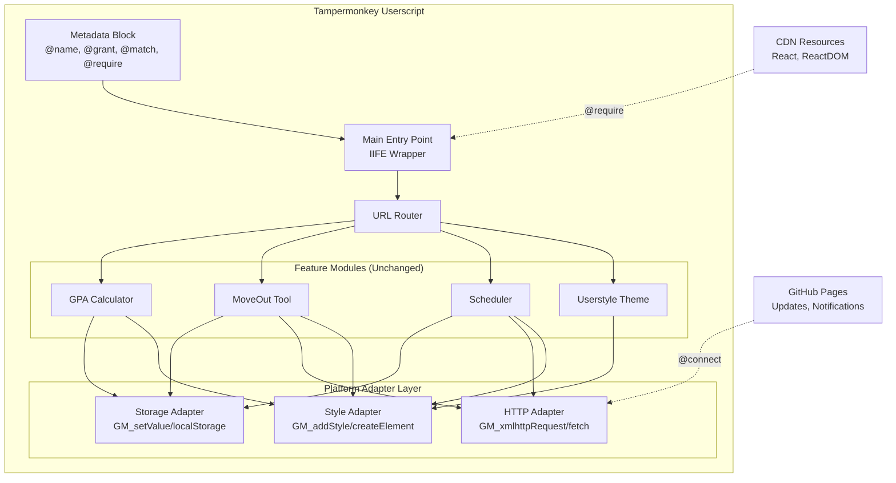
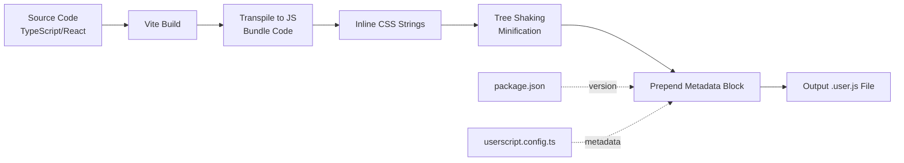

# Design Document: FAP-AIO Tampermonkey Userscript Conversion

## Overview

This design document outlines the technical architecture for converting the FAP-AIO browser extension into a Tampermonkey userscript. The conversion maintains feature parity while adapting to the userscript execution model, which differs significantly from browser extensions.

### Key Design Principles

1. **Platform Abstraction**: Core feature logic remains unchanged; only the platform integration layer is adapted
2. **Single Artifact**: All code compiles into one .user.js file with external dependencies via CDN
3. **Progressive Enhancement**: Features degrade gracefully when GM APIs are unavailable
4. **Zero Configuration**: Users install the script and it works immediately
5. **Shared Codebase**: Where possible, maintain the same TypeScript/React source code

### Fundamental Differences: Extension vs Userscript

| Aspect | Browser Extension | Tampermonkey Userscript |
|--------|-------------------|-------------------------|
| Entry Point | manifest.json + background/content scripts | Metadata block + single JS execution |
| Execution Context | Isolated content script world | Page context (or isolated with @grant) |
| UI Components | Popup, options page, sidepanel | All UI injected into page DOM |
| Storage | chrome.storage.sync/local | GM_setValue/GM_getValue or localStorage |
| Network | fetch with host_permissions | GM_xmlhttpRequest with @connect |
| CSS | Injected via manifest or chrome.scripting | GM_addStyle or <style> elements |
| Dependencies | Bundled or loaded via web_accessible_resources | Bundled inline or @require from CDN |
| Updates | Chrome Web Store | @updateURL pointing to hosted file |
| Installation | .crx package via store | Click .user.js link, auto-install |
| HTML Parsing | Cheerio (server-side library) | DOMParser + native DOM APIs |

### Critical Conversion Challenges

The conversion faces several significant challenges that must be addressed:

#### 1. **Cheerio Dependency Removal** (CRITICAL)
**Problem**: The extension uses Cheerio (`cheerio` package) for HTML parsing, which is a Node.js/server-side library that:
- Requires Node.js built-in modules not available in browsers
- Cannot run in browser context without massive polyfills (30-50KB)
- Would bloat the userscript bundle significantly

**Current Usage**:
```typescript
// GPA module: src/contentScript/features/gpa/App.tsx
import * as cheerio from "cheerio";
// Used to parse transcript table HTML

// MoveOut module: src/contentScript/features/moveout/App.tsx
import * as cheerio from "cheerio";
// Used to parse class data HTML responses
```

**Solution**: Replace all Cheerio usage with native browser APIs:
- `DOMParser` for parsing HTML strings
- `querySelector/querySelectorAll` for element selection
- `textContent/innerText` for text extraction
- Temporary DOM elements for complex manipulation

**Impact**: Requires refactoring GPA and MoveOut modules but eliminates 30KB+ dependency and ensures browser compatibility.

#### 2. **Bundle Size Optimization**
**Realistic Targets** (revised from initial spec):
- Uncompressed: < 400KB (was 500KB)
- Gzipped: < 100KB (was 150KB)
- React + ReactDOM (external CDN): ~40KB not included in bundle

**Bundle Breakdown Estimate**:
- Application code (4 features): ~80-120KB
- Adapters + utilities: ~20-30KB
- CSS inline: ~40-50KB
- Total before minify: ~150-200KB → ~80-100KB gzipped

#### 3. **Storage Refactoring Required**
**Problem**: Current code uses `localStorage` directly in multiple places:
```typescript
// Scattered throughout features
localStorage.getItem('key');
localStorage.setItem('key', value);
```

**Solution**: Must refactor ALL features to use storage adapter before conversion:
```typescript
// After refactoring
import { storage } from '@/userscript/adapters/storage.adapter';
storage.get('key');
storage.set('key', value);
```

#### 4. **Network Request Centralization**
**Problem**: Features use `fetch()` directly without abstraction layer.

**Solution**: Refactor to use HTTP adapter for all network operations (especially MoveOut form submissions and GitHub Pages requests).

## Architecture

### High-Level Structure

**Directory Structure**:
```
userscript/fap-aio/                    # Userscript implementation root
├── src/
│   ├── userscript/                   # Userscript-specific code
│   │   ├── adapters/                # Platform adapters
│   │   │   ├── storage.adapter.ts   # GM_setValue/GM_getValue wrapper
│   │   │   ├── http.adapter.ts      # GM_xmlhttpRequest wrapper
│   │   │   └── style.adapter.ts     # GM_addStyle wrapper
│   │   ├── utils/                   # Userscript utilities
│   │   │   └── dom-parser.ts        # Native DOM parser (Cheerio replacement)
│   │   ├── main.ts                  # Entry point (IIFE wrapper)
│   │   └── router.ts                # Feature routing
│   └── (shared feature code from fap-aio/src/contentScript/features/)
├── scripts/
│   └── generate-metadata.ts         # Metadata block generator
├── dist/
│   └── fap-aio.user.js             # Built userscript
├── vite.userscript.config.ts       # Vite build config
└── package.json                     # Dependencies and scripts
```



### Directory Structure for Build

```
fap-aio/
├── src/
│   ├── userscript/
│   │   ├── main.ts                    # Userscript entry point
│   │   ├── metadata.ts                # Generates metadata block
│   │   ├── adapters/
│   │   │   ├── storage.adapter.ts     # GM_setValue/localStorage wrapper
│   │   │   ├── http.adapter.ts        # GM_xmlhttpRequest/fetch wrapper
│   │   │   └── style.adapter.ts       # GM_addStyle/createElement wrapper
│   │   └── router.ts                  # URL-based feature routing
│   │
│   ├── contentScript/
│   │   ├── features/                  # Reused from extension (minimal changes)
│   │   │   ├── gpa/
│   │   │   ├── moveout/
│   │   │   ├── scheduler/
│   │   │   └── shared/
│   │   └── shared/                    # Platform-agnostic utilities
│   │       ├── dom.ts
│   │       ├── constants.ts
│   │       └── types.ts
│   │
│   └── styles/
│       ├── userstyle.css              # Converted to string in build
│       └── tailwind.css
│
├── scripts/
│   ├── build-userscript.ts            # Build script for userscript
│   └── generate-metadata.ts           # Generates metadata block
│
├── userscript.config.ts               # Userscript build configuration
├── vite.userscript.config.ts          # Vite config for userscript build
└── dist/
    └── fap-aio.user.js                # Final userscript output
```

## Components and Interfaces

### 0. Cheerio to Native DOM Migration Strategy

**Purpose**: Replace Cheerio with browser-native DOM APIs to eliminate Node.js dependency.

#### Current Cheerio Usage Patterns:

```typescript
// BEFORE (Extension with Cheerio)
import * as cheerio from "cheerio";

// Parse HTML string
const $ = cheerio.load(htmlString);

// Select elements
const rows = $('table tr');
const cell = $(row).find('td').eq(2);

// Extract text
const text = $(element).text().trim();

// Get attributes
const href = $(link).attr('href');
```

#### Native DOM Replacement:

```typescript
// AFTER (Userscript with native APIs)

// Parse HTML string
const parser = new DOMParser();
const doc = parser.parseFromString(htmlString, 'text/html');

// Select elements
const rows = doc.querySelectorAll('table tr');
const cell = row.querySelectorAll('td')[2];
// Or: const cell = row.querySelector('td:nth-child(3)');

// Extract text
const text = element.textContent.trim();

// Get attributes
const href = link.getAttribute('href');
```

#### Cheerio Migration Utility:

```typescript
// src/userscript/utils/dom-parser.ts

/**
 * Parses HTML string into Document object
 * Replacement for cheerio.load()
 */
export function parseHTML(htmlString: string): Document {
  const parser = new DOMParser();
  return parser.parseFromString(htmlString, 'text/html');
}

/**
 * Parses HTML fragment and returns first element
 * Useful for single-element extraction
 */
export function parseHTMLFragment(htmlString: string): Element | null {
  const temp = document.createElement('div');
  temp.innerHTML = htmlString;
  return temp.firstElementChild;
}

/**
 * jQuery-like text extraction with trim
 */
export function getText(element: Element | null): string {
  return element?.textContent?.trim() || '';
}

/**
 * Safe attribute getter
 */
export function getAttr(element: Element | null, attr: string): string {
  return element?.getAttribute(attr) || '';
}

/**
 * Query selector with optional context
 */
export function query(selector: string, context: Document | Element = document): Element | null {
  return context.querySelector(selector);
}

/**
 * Query all with array return (not NodeList)
 */
export function queryAll(selector: string, context: Document | Element = document): Element[] {
  return Array.from(context.querySelectorAll(selector));
}
```

#### Migration Examples for Each Module:

**GPA Module** (`src/contentScript/features/gpa/App.tsx`):
```typescript
// BEFORE
const $ = cheerio.load(transcriptHTML);
const rows = $('table tbody tr');
rows.each((i, row) => {
  const code = $(row).find('td').eq(0).text().trim();
  const grade = $(row).find('td').eq(3).text().trim();
});

// AFTER
import { parseHTML, getText, queryAll } from '@/userscript/utils/dom-parser';

const doc = parseHTML(transcriptHTML);
const rows = queryAll('table tbody tr', doc);
rows.forEach((row) => {
  const cells = row.querySelectorAll('td');
  const code = getText(cells[0]);
  const grade = getText(cells[3]);
});
```

**MoveOut Module** (`src/contentScript/features/moveout/App.tsx`):
```typescript
// BEFORE
const $ = cheerio.load(responseHTML);
const classRows = $('table.class-schedule tr');
const lecturer = $(row).find('.lecturer').text().trim();

// AFTER
import { parseHTML, getText, queryAll } from '@/userscript/utils/dom-parser';

const doc = parseHTML(responseHTML);
const classRows = queryAll('table.class-schedule tr', doc);
const lecturerEl = row.querySelector('.lecturer');
const lecturer = getText(lecturerEl);
```

### 1. Metadata Block Generator

**Purpose**: Generate the userscript metadata block with all required directives.

```typescript
// scripts/generate-metadata.ts

interface UserscriptMetadata {
  name: string;
  namespace: string;
  version: string;
  description: string;
  author: string;
  match: string[];
  grant: string[];
  require: string[];
  connect: string[];
  runAt: 'document-start' | 'document-end' | 'document-idle';
  updateURL?: string;
  downloadURL?: string;
  homepageURL?: string;
  icon?: string;
}

export function generateMetadataBlock(metadata: UserscriptMetadata): string {
  return `
// ==UserScript==
// @name         ${metadata.name}
// @namespace    ${metadata.namespace}
// @version      ${metadata.version}
// @description  ${metadata.description}
// @author       ${metadata.author}
${metadata.match.map(m => `// @match        ${m}`).join('\n')}
${metadata.grant.map(g => `// @grant        ${g}`).join('\n')}
${metadata.require.map(r => `// @require      ${r}`).join('\n')}
${metadata.connect.map(c => `// @connect      ${c}`).join('\n')}
// @run-at       ${metadata.runAt}
${metadata.updateURL ? `// @updateURL    ${metadata.updateURL}` : ''}
${metadata.downloadURL ? `// @downloadURL  ${metadata.downloadURL}` : ''}
${metadata.homepageURL ? `// @homepageURL  ${metadata.homepageURL}` : ''}
${metadata.icon ? `// @icon         ${metadata.icon}` : ''}
// ==/UserScript==
`.trim();
}
```

**Configuration Values**:
```typescript
const metadata: UserscriptMetadata = {
  name: 'FAP-AIO',
  namespace: 'https://github.com/ruskicoder/fap-aio',
  version: '1.0.0', // Read from package.json
  description: 'All-in-One Enhancement for FPT University Academic Portal',
  author: 'ruskicoder',
  match: ['https://fap.fpt.edu.vn/*'],
  grant: [
    'GM_setValue',
    'GM_getValue',
    'GM_deleteValue',
    'GM_addStyle',
    'GM_xmlhttpRequest',
    'GM_info',
  ],
  require: [
    'https://unpkg.com/react@18/umd/react.production.min.js',
    'https://unpkg.com/react-dom@18/umd/react-dom.production.min.js',
  ],
  connect: [
    'fap.fpt.edu.vn',
    'ruskicoder.github.io',
  ],
  runAt: 'document-start',
  updateURL: 'https://ruskicoder.github.io/fap-aio/fap-aio.user.js',
  downloadURL: 'https://ruskicoder.github.io/fap-aio/fap-aio.user.js',
  homepageURL: 'https://github.com/ruskicoder/fap-aio',
  icon: 'https://fap.fpt.edu.vn/favicon.ico',
};
```

### 2. Storage Adapter

**Purpose**: Abstract storage operations to work with GM_setValue/GM_getValue or fallback to localStorage.

```typescript
// src/userscript/adapters/storage.adapter.ts

type StorageValue = string | number | boolean | object | null;

interface StorageAdapter {
  get<T = StorageValue>(key: string): T | null;
  set<T = StorageValue>(key: string, value: T): void;
  remove(key: string): void;
  clear(): void;
  isExpired(key: string): boolean;
}

class GMStorageAdapter implements StorageAdapter {
  private prefix = 'fap-aio:';
  private useGM: boolean;

  constructor() {
    // Check if GM_setValue is available
    this.useGM = typeof GM_setValue !== 'undefined';
    if (!this.useGM) {
      console.warn('[FAP-AIO] GM storage not available, falling back to localStorage');
    }
  }

  get<T>(key: string): T | null {
    const fullKey = this.prefix + key;
    try {
      let item: string | null;
      
      if (this.useGM) {
        item = GM_getValue(fullKey, null);
      } else {
        item = localStorage.getItem(fullKey);
      }
      
      return item ? JSON.parse(item) : null;
    } catch (e) {
      console.error('[FAP-AIO] Storage get error:', e);
      return null;
    }
  }

  set<T>(key: string, value: T): void {
    const fullKey = this.prefix + key;
    try {
      const serialized = JSON.stringify(value);
      
      if (this.useGM) {
        GM_setValue(fullKey, serialized);
      } else {
        localStorage.setItem(fullKey, serialized);
      }
    } catch (e) {
      console.error('[FAP-AIO] Storage set error:', e);
    }
  }

  remove(key: string): void {
    const fullKey = this.prefix + key;
    try {
      if (this.useGM) {
        GM_deleteValue(fullKey);
      } else {
        localStorage.removeItem(fullKey);
      }
    } catch (e) {
      console.error('[FAP-AIO] Storage remove error:', e);
    }
  }

  clear(): void {
    // Clear all keys with our prefix
    if (this.useGM) {
      // GM doesn't have listValues in older versions, so we track keys
      const keysToDelete = ['examSchedule', 'weeklySchedule', 'semesterSyncState', 
                           'selectedSemester', 'pendingSemesterSync', 'gpaConfig'];
      keysToDelete.forEach(key => this.remove(key));
    } else {
      Object.keys(localStorage).forEach(key => {
        if (key.startsWith(this.prefix)) {
          localStorage.removeItem(key);
        }
      });
    }
  }

  isExpired(key: string): boolean {
    const data = this.get<{ timestamp: number; expiry?: number }>(key);
    if (!data || !data.expiry) return false;
    return Date.now() - data.timestamp > data.expiry;
  }
}

export const storage = new GMStorageAdapter();
```

### 3. HTTP Adapter

**Purpose**: Abstract HTTP requests to use GM_xmlhttpRequest with fetch fallback.

```typescript
// src/userscript/adapters/http.adapter.ts

interface RequestOptions {
  method?: 'GET' | 'POST' | 'PUT' | 'DELETE';
  headers?: Record<string, string>;
  body?: string | FormData;
  timeout?: number;
}

interface Response<T = any> {
  data: T;
  status: number;
  statusText: string;
  headers: Record<string, string>;
}

class HTTPAdapter {
  private useGM: boolean;

  constructor() {
    this.useGM = typeof GM_xmlhttpRequest !== 'undefined';
    if (!this.useGM) {
      console.warn('[FAP-AIO] GM_xmlhttpRequest not available, using fetch (CORS limited)');
    }
  }

  async request<T = any>(url: string, options: RequestOptions = {}): Promise<Response<T>> {
    if (this.useGM) {
      return this.gmRequest<T>(url, options);
    } else {
      return this.fetchRequest<T>(url, options);
    }
  }

  private gmRequest<T>(url: string, options: RequestOptions): Promise<Response<T>> {
    return new Promise((resolve, reject) => {
      GM_xmlhttpRequest({
        method: options.method || 'GET',
        url: url,
        headers: options.headers || {},
        data: options.body as string,
        timeout: options.timeout || 30000,
        onload: (response) => {
          try {
            const data = response.responseText.startsWith('{') || response.responseText.startsWith('[')
              ? JSON.parse(response.responseText)
              : response.responseText;
            
            resolve({
              data: data as T,
              status: response.status,
              statusText: response.statusText,
              headers: this.parseHeaders(response.responseHeaders),
            });
          } catch (e) {
            reject(new Error('Failed to parse response'));
          }
        },
        onerror: (error) => {
          reject(new Error(`Request failed: ${error.statusText || 'Unknown error'}`));
        },
        ontimeout: () => {
          reject(new Error('Request timeout'));
        },
      });
    });
  }

  private async fetchRequest<T>(url: string, options: RequestOptions): Promise<Response<T>> {
    try {
      const response = await fetch(url, {
        method: options.method || 'GET',
        headers: options.headers,
        body: options.body,
      });

      const contentType = response.headers.get('content-type');
      const data = contentType?.includes('application/json')
        ? await response.json()
        : await response.text();

      return {
        data: data as T,
        status: response.status,
        statusText: response.statusText,
        headers: Object.fromEntries(response.headers.entries()),
      };
    } catch (e) {
      throw new Error(`Fetch request failed: ${e.message}`);
    }
  }

  private parseHeaders(headersString: string): Record<string, string> {
    const headers: Record<string, string> = {};
    headersString.split('\r\n').forEach(line => {
      const [key, value] = line.split(': ');
      if (key && value) headers[key.toLowerCase()] = value;
    });
    return headers;
  }

  async get<T = any>(url: string, options?: RequestOptions): Promise<Response<T>> {
    return this.request<T>(url, { ...options, method: 'GET' });
  }

  async post<T = any>(url: string, body: string | FormData, options?: RequestOptions): Promise<Response<T>> {
    return this.request<T>(url, { ...options, method: 'POST', body });
  }
}

export const http = new HTTPAdapter();
```

### 4. Style Adapter

**Purpose**: Abstract CSS injection to use GM_addStyle with fallback to <style> elements.

```typescript
// src/userscript/adapters/style.adapter.ts

class StyleAdapter {
  private useGM: boolean;
  private injectedStyles: Set<string> = new Set();

  constructor() {
    this.useGM = typeof GM_addStyle !== 'undefined';
    if (!this.useGM) {
      console.warn('[FAP-AIO] GM_addStyle not available, using style elements');
    }
  }

  inject(css: string, id?: string): void {
    // Prevent duplicate injection
    if (id && this.injectedStyles.has(id)) {
      return;
    }

    if (this.useGM) {
      GM_addStyle(css);
    } else {
      const style = document.createElement('style');
      if (id) style.id = id;
      style.textContent = css;
      document.head.appendChild(style);
    }

    if (id) this.injectedStyles.add(id);
  }

  remove(id: string): void {
    if (!this.useGM && id) {
      const style = document.getElementById(id);
      if (style) style.remove();
    }
    this.injectedStyles.delete(id);
  }
}

export const styleAdapter = new StyleAdapter();
```

### 5. Main Entry Point

**Purpose**: Initialize the userscript, set up adapters, and route to features.

```typescript
// src/userscript/main.ts

import { storage } from './adapters/storage.adapter';
import { http } from './adapters/http.adapter';
import { styleAdapter } from './adapters/style.adapter';
import { routeToFeature } from './router';

// Import styles as strings (transformed by build)
import userstyleCSS from '../styles/userstyle.css?inline';
import tailwindCSS from '../styles/tailwind.css?inline';

(function() {
  'use strict';

  // Prevent duplicate initialization
  if ((window as any).__FAP_AIO_LOADED__) {
    console.warn('[FAP-AIO] Already loaded, skipping initialization');
    return;
  }
  (window as any).__FAP_AIO_LOADED__ = true;

  console.info('[FAP-AIO] Userscript initializing...');

  // Wait for React to be available (loaded via @require)
  function waitForReact(): Promise<void> {
    return new Promise((resolve) => {
      if (typeof React !== 'undefined' && typeof ReactDOM !== 'undefined') {
        resolve();
      } else {
        const interval = setInterval(() => {
          if (typeof React !== 'undefined' && typeof ReactDOM !== 'undefined') {
            clearInterval(interval);
            resolve();
          }
        }, 100);
        
        // Timeout after 5 seconds
        setTimeout(() => {
          clearInterval(interval);
          console.error('[FAP-AIO] React/ReactDOM not loaded after 5 seconds');
          resolve(); // Continue anyway
        }, 5000);
      }
    });
  }

  // Initialize
  async function init() {
    try {
      // Inject global styles immediately
      styleAdapter.inject(userstyleCSS, 'fap-aio-userstyle');
      styleAdapter.inject(tailwindCSS, 'fap-aio-tailwind');

      // Wait for React if features need it
      await waitForReact();

      // Route to appropriate feature based on URL
      if (document.readyState === 'loading') {
        document.addEventListener('DOMContentLoaded', () => routeToFeature(storage, http, styleAdapter));
      } else {
        routeToFeature(storage, http, styleAdapter);
      }

      console.info('[FAP-AIO] Initialization complete');
    } catch (error) {
      console.error('[FAP-AIO] Initialization failed:', error);
    }
  }

  init();
})();
```

### 6. Router

**Purpose**: Route to appropriate feature modules based on URL.

```typescript
// src/userscript/router.ts

import { initGPA } from '../contentScript/features/gpa';
import { initMoveOut } from '../contentScript/features/moveout';
import { initScheduler } from '../contentScript/features/scheduler';
import { dom } from '../contentScript/shared/dom';
import type { StorageAdapter } from './adapters/storage.adapter';
import type { HTTPAdapter } from './adapters/http.adapter';
import type { StyleAdapter } from './adapters/style.adapter';

export function routeToFeature(
  storage: StorageAdapter,
  http: HTTPAdapter,
  style: StyleAdapter
): void {
  const url = window.location.href;

  // Enhance UI on all FAP pages (from shared/dom.ts)
  dom.enhanceUI();

  // Route to specific features
  if (url.includes('/Grade/StudentTranscript.aspx')) {
    console.info('[FAP-AIO] Loading GPA Calculator');
    initGPA();
  } else if (url.includes('/FrontOffice/MoveSubject.aspx') || url.includes('/FrontOffice/Courses.aspx')) {
    console.info('[FAP-AIO] Loading MoveOut Tool');
    initMoveOut();
  } else if (url.includes('/Exam/ScheduleExams.aspx') || url.includes('/Report/ScheduleOfWeek.aspx')) {
    console.info('[FAP-AIO] Loading Scheduler');
    initScheduler();
  }
}
```

## Data Models

### Storage Schema

The userscript uses the same storage keys as the extension for consistency:

```typescript
// Storage keys (prefixed with 'fap-aio:')
interface StorageSchema {
  // Scheduler
  'examSchedule': ScheduleEvent[];
  'weeklySchedule': ScheduleEvent[];
  'semesterSyncState': SemesterSyncState | null;
  'selectedSemester': string;
  'pendingSemesterSync': boolean;
  
  // GPA
  'gpaConfig': {
    nonGPAKeys: string[];
  };
  
  // MoveOut
  'moveout:timetable:{subject}': {
    data: Map<string, Map<string, string[]>>;
    timestamp: number;
    expiry: number; // 24 hours
  };
}
```

## Build Process

### Build Pipeline



### Vite Configuration for Userscript

```typescript
// vite.userscript.config.ts

import { defineConfig } from 'vite';
import react from '@vitejs/plugin-react';
import path from 'path';
import { readFileSync } from 'fs';
import { generateMetadataBlock } from './scripts/generate-metadata';

export default defineConfig({
  plugins: [
    react(),
    {
      name: 'userscript-metadata',
      generateBundle(options, bundle) {
        // Get the main chunk
        const mainChunk = Object.values(bundle).find(
          (chunk) => chunk.type === 'chunk' && chunk.isEntry
        );
        
        if (mainChunk && mainChunk.type === 'chunk') {
          // Read package.json for version
          const pkg = JSON.parse(readFileSync('./package.json', 'utf-8'));
          
          // Generate metadata block
          const metadata = generateMetadataBlock({
            name: 'FAP-AIO',
            namespace: 'https://github.com/ruskicoder/fap-aio',
            version: pkg.version,
            description: pkg.description,
            author: pkg.author,
            match: ['https://fap.fpt.edu.vn/*'],
            grant: ['GM_setValue', 'GM_getValue', 'GM_deleteValue', 'GM_addStyle', 'GM_xmlhttpRequest', 'GM_info'],
            require: [
              'https://unpkg.com/react@18/umd/react.production.min.js',
              'https://unpkg.com/react-dom@18/umd/react-dom.production.min.js',
            ],
            connect: ['fap.fpt.edu.vn', 'ruskicoder.github.io'],
            runAt: 'document-start',
            updateURL: 'https://ruskicoder.github.io/fap-aio/fap-aio.user.js',
            downloadURL: 'https://ruskicoder.github.io/fap-aio/fap-aio.user.js',
            homepageURL: 'https://github.com/ruskicoder/fap-aio',
          });
          
          // Prepend metadata block
          mainChunk.code = metadata + '\n\n' + mainChunk.code;
        }
      },
    },
    {
      name: 'css-to-string',
      transform(code, id) {
        // Transform CSS imports to strings
        if (id.includes('?inline') || id.endsWith('.css')) {
          return {
            code: `export default ${JSON.stringify(code)}`,
            map: null,
          };
        }
      },
    },
  ],
  resolve: {
    alias: {
      '@': path.resolve(__dirname, './src'),
    },
  },
  build: {
    outDir: 'dist',
    emptyOutDir: true,
    lib: {
      entry: path.resolve(__dirname, 'src/userscript/main.ts'),
      name: 'FAP_AIO',
      formats: ['iife'],
      fileName: () => 'fap-aio.user.js',
    },
    rollupOptions: {
      external: ['react', 'react-dom'],
      output: {
        globals: {
          'react': 'React',
          'react-dom': 'ReactDOM',
        },
        // Don't add use strict (userscript metadata handles this)
        banner: '',
        intro: '',
      },
    },
    minify: false, // Keep readable for review, or use 'terser' for production
  },
});
```

## Feature Module Adaptations

### Minimal Changes Required

Most feature code remains unchanged. Only these adapters are needed:

**Before (Extension)**:
```typescript
// In extension features
import { storage } from '@/contentScript/shared/storage';
```

**After (Userscript)**:
```typescript
// In userscript features - storage passed as dependency
import { storage } from '@/userscript/adapters/storage.adapter';
```

### Feature Module Updates

1. **GPA Calculator**: No changes needed - uses DOM manipulation and local state
2. **MoveOut Tool**: Replace fetch with `http.post()` for form submissions
3. **Scheduler**: Replace fetch with `http.get()` for GitHub Pages resources
4. **Userstyle**: No changes needed - injected via styleAdapter

## Error Handling

### Error Boundary Pattern

```typescript
// Wrap React components in error boundaries
class ErrorBoundary extends React.Component {
  state = { hasError: false, error: null };
  
  static getDerivedStateFromError(error: Error) {
    return { hasError: true, error };
  }
  
  componentDidCatch(error: Error, info: any) {
    console.error('[FAP-AIO] React Error:', error, info);
  }
  
  render() {
    if (this.state.hasError) {
      return React.createElement('div', { 
        style: { padding: '20px', background: '#ff4444', color: '#fff' } 
      }, 'Feature failed to load. Check console for details.');
    }
    return this.props.children;
  }
}
```

### Graceful Degradation

```typescript
// Example: Fallback when GM APIs unavailable
function initFeature() {
  try {
    // Try full functionality
    if (typeof GM_setValue !== 'undefined') {
      initFullFeature();
    } else {
      // Fallback to localStorage
      console.warn('[FAP-AIO] Limited functionality: GM APIs not available');
      initLimitedFeature();
    }
  } catch (error) {
    console.error('[FAP-AIO] Feature init failed:', error);
    showErrorNotification('Feature unavailable. Please refresh the page.');
  }
}
```

## Testing Strategy

### Manual Testing Checklist

- [ ] Install in Tampermonkey (Chrome)
- [ ] Install in Violentmonkey (Firefox)
- [ ] Install in Greasemonkey (Firefox)
- [ ] Test on each FAP page (transcript, courses, exams, weekly)
- [ ] Verify dark theme applies on all pages
- [ ] Test GPA calculator functionality
- [ ] Test MoveOut class switching
- [ ] Test Scheduler ICS export
- [ ] Test storage persistence across page reloads
- [ ] Test auto-update mechanism
- [ ] Test with GM APIs disabled (fallback mode)

### Automated Testing (Future Enhancement)

```typescript
// Unit tests for adapters
describe('StorageAdapter', () => {
  it('should use GM_setValue when available', () => { /* ... */ });
  it('should fallback to localStorage when GM unavailable', () => { /* ... */ });
});

describe('HTTPAdapter', () => {
  it('should use GM_xmlhttpRequest when available', () => { /* ... */ });
  it('should fallback to fetch when GM unavailable', () => { /* ... */ });
});
```

## Deployment

### GitHub Pages Hosting

```yaml
# .github/workflows/deploy-userscript.yml

name: Deploy Userscript

on:
  push:
    branches: [main]
    tags:
      - 'v*'

jobs:
  build-and-deploy:
    runs-on: ubuntu-latest
    steps:
      - uses: actions/checkout@v3
      
      - name: Setup Node.js
        uses: actions/setup-node@v3
        with:
          node-version: '18'
      
      - name: Install dependencies
        run: npm install
      
      - name: Build userscript
        run: npm run build:userscript
      
      - name: Deploy to GitHub Pages
        uses: peaceiris/actions-gh-pages@v3
        with:
          github_token: ${{ secrets.GITHUB_TOKEN }}
          publish_dir: ./dist
          keep_files: true
```

### Update Mechanism

1. User installs from: `https://ruskicoder.github.io/fap-aio/fap-aio.user.js`
2. Tampermonkey checks `@updateURL` daily
3. If version in hosted file > installed version, prompt user to update
4. User clicks update, new version installed automatically
5. Page reload applies new version

## Security Considerations

### @connect Whitelist

Only allow connections to trusted domains:
- `fap.fpt.edu.vn` - FAP portal (for form submissions)
- `ruskicoder.github.io` - Notification/version data

### External Dependencies

Load React from trusted CDN (unpkg.com):
- Integrity checks via SRI (Subresource Integrity) if Tampermonkey supports
- Fallback to bundled version if CDN fails

### User Data Protection

- Store sensitive data (schedules, settings) using GM storage
- Never transmit user data to external servers
- All processing happens client-side

### Code Review

- Userscript is open source for community review
- Transparent about what data is stored and where
- No obfuscation or minification in production (optional)

## Migration Path

### For Existing Extension Users

1. Uninstall browser extension
2. Install userscript from GitHub Pages
3. Data migration: Userscript checks localStorage for extension data, migrates to GM storage
4. Feature parity ensures no loss of functionality

### Dual Installation Support

If users want both:
- Different storage namespaces prevent conflicts
- Extension: `fap-aio-ext:*`
- Userscript: `fap-aio:*`

## Performance Optimizations

### Performance Optimizations

### Bundle Size Reduction

1. **Tree Shaking**: Remove unused code paths
2. **External Dependencies**: Load React via CDN (saves ~40KB)
3. **Cheerio Elimination**: Remove Cheerio dependency (saves ~30KB)
4. **Code Splitting**: Not applicable (single file), but lazy-load non-critical features
5. **Minification**: Optional (terser for production)

**Realistic Bundle Sizes**:
- Application code: ~100KB
- CSS inlined: ~40KB
- Adapters: ~20KB
- Total uncompressed: ~160KB → ~80KB gzipped (excluding external React)
- With aggressive optimization: ~140KB → ~70KB gzipped

Target sizes (revised):
- Uncompressed: < 400KB
- Gzipped: < 100KB

### Runtime Performance

1. **Efficient DOM Queries**: Cache selectors, use specific queries
2. **Debounce/Throttle**: For event handlers (scroll, resize)
3. **React Optimization**: useMemo, useCallback for expensive computations
4. **Lazy Initialization**: Load feature modules only when needed

## Maintenance

### Version Management

- Follow semantic versioning (MAJOR.MINOR.PATCH)
- Update `@version` in metadata block for each release
- Maintain CHANGELOG.md with release notes

### Issue Tracking

- GitHub Issues for bug reports and feature requests
- Labels: `userscript`, `extension`, `bug`, `enhancement`
- Separate issues for userscript-specific problems

### Documentation

- README with installation instructions
- FAQ for common issues
- Developer guide for contributing

## Future Enhancements

### Potential Improvements

1. **Multi-Language Support**: i18n for English/Vietnamese
2. **Settings UI**: In-page settings modal (replace extension options page)
3. **Sync Across Devices**: Optional cloud sync via user's own storage (Dropbox, Google Drive)
4. **Offline Mode**: Service Worker registration if supported in userscript context
5. **Advanced Filters**: More complex filtering logic for MoveOut
6. **Calendar Integration**: Direct sync to Google Calendar API (with user auth)
7. **Notifications**: Browser notifications for exam reminders (if permissions available)

### Community Contributions

- Accept PRs for new features
- Community-maintained forks for experimental features
- Plugin system for third-party extensions
