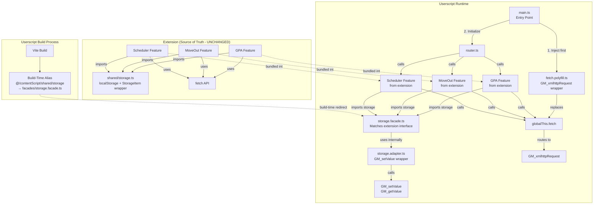
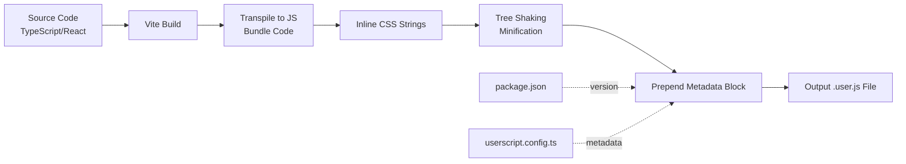

# Design Document: FAP-AIO Tampermonkey Userscript Conversion

## Overview

This design document outlines the technical architecture for converting the FAP-AIO browser extension into a Tampermonkey userscript. The conversion maintains feature parity while adapting to the userscript execution model, which differs significantly from browser extensions.

### Key Design Principles

1. **Platform Abstraction**: Core feature logic remains unchanged; only the platform integration layer is adapted
2. **Single Artifact**: All code compiles into one .user.js file with external dependencies via CDN
3. **Progressive Enhancement**: Features degrade gracefully when GM APIs are unavailable
4. **Zero Configuration**: Users install the script and it works immediately
5. **Shared Codebase**: Where possible, maintain the same TypeScript/React source code

### Fundamental Differences: Extension vs Userscript

| Aspect | Browser Extension | Tampermonkey Userscript |
|--------|-------------------|-------------------------|
| Entry Point | manifest.json + background/content scripts | Metadata block + single JS execution |
| Execution Context | Isolated content script world | Page context (or isolated with @grant) |
| UI Components | Popup, options page, sidepanel | All UI injected into page DOM |
| Storage | chrome.storage.sync/local | GM_setValue/GM_getValue or localStorage |
| Network | fetch with host_permissions | GM_xmlhttpRequest with @connect |
| CSS | Injected via manifest or chrome.scripting | GM_addStyle or <style> elements |
| Dependencies | Bundled or loaded via web_accessible_resources | Bundled inline or @require from CDN |
| Updates | Chrome Web Store | @updateURL pointing to hosted file |
| Installation | .crx package via store | Click .user.js link, auto-install |
| HTML Parsing | Cheerio (server-side library) | DOMParser + native DOM APIs |

## Implementation Decisions & Clarifications

Based on requirements analysis and technical discussions, the following implementation decisions have been finalized:

### A. Adapter Design Patterns

**A1. Storage Adapter - Automatic Key Prefixing**
- The adapter automatically adds `fap-aio:` prefix to all keys
- Features pass simple keys (e.g., `'gpaConfig'`), stored as `'fap-aio:gpaConfig'`
- Maximizes compatibility and prevents key collisions

**A2. HTTP Adapter - Auto-Detection**
- Automatically detects response type based on Content-Type header
- Returns parsed JSON objects when Content-Type includes 'application/json'
- Returns raw text/HTML for other content types
- Features can handle both without explicit type specification

**A3. Error Handling Strategy**
- Adapters log warnings but continue with fallbacks
- Comprehensive logging for easy debugging
- No exceptions thrown that would break userscript execution
- Graceful degradation when GM APIs unavailable

### B. Build System Architecture

**B1. CSS Bundling Strategy**
- Custom Vite plugin to transform CSS into JavaScript strings
- Single output file constraint: `dist/fap-aio.user.js`
- All CSS inlined as strings for GM_addStyle injection
- No external CSS files or @resource directives

**B2. TypeScript Path Aliases**
- New alias: `@userscript/` for userscript-specific code
- Prevents cross-contamination between extension and userscript builds
- Userscript errors won't affect extension compilation
- Clear separation of concerns

**B3. Source Maps**
- **Not included** in production builds
- Reduces file size and maintains clean output
- Debug via console logging instead

### C. Feature Integration Patterns

**C1. Import Strategy - Barrel File Re-exports**
- Option 3 selected: Re-export through userscript barrel file
- Maximizes code readability and maintainability
- Centralized feature management
- Example: `import { initGPA } from '@userscript/features'`

**C2. Platform Compatibility**
- Features verified to use universal methods (no chrome.* APIs)
- Storage abstraction already in place (localStorage-based)
- DOM parser utilities replace Cheerio
- All features are platform-agnostic by design

**C3. React Component Mounting**
- **Shared mounting utility** in userscript utils
- Lightweight, reusable across all features
- Centralizes ReactDOM.createRoot logic
- Provides error boundaries integration

### D. Metadata Configuration

**D1. CDN Version Strategy**
- Major version lock for React: `@18` (e.g., react@18/umd/react.production.min.js)
- Ensures security while maintaining compatibility
- Auto-updates to latest stable 18.x minor/patch versions
- Prevents breaking changes from major version bumps

**D2. Update URL Configuration**
- Include @updateURL in initial builds: `https://ruskicoder.github.io/fap-aio/fap-aio.user.js`
- Include @downloadURL pointing to same location
- GitHub Pages deployment configured after Phase 3/4
- Auto-update mechanism active from first deployment

**D3. Favicon Embedding**
- Favicon base64-encoded and embedded in @icon directive
- Source: `userscript/fap-aio/image.txt` (FPTShop favicon URL)
- No external icon resources required
- Embedded directly in metadata block

### E. Testing Strategy

**E1. Phase Validation Checkpoints**
- **Phase 1 (Adapters)**: Manual console tests in terminal, no test files in codebase
- **Phase 2 (Entry/Router)**: Verify loads without errors, routing logs correctly
- **Phase 3 (Build)**: Validate metadata format, imports resolved, no syntax errors
- **Phase 4 (Features)**: Each feature tested individually, then end-user integration testing

**E2. Test Environment**
- **Live FAP site only** - no mock data or HTML fixtures
- Testing in Tampermonkey on Opera GX browser
- Assumes compatibility with other browsers/managers

### E. Testing Strategy

**E1. Phase Validation Checkpoints**
- **Phase 1 (Adapters)**: Manual console tests in terminal, no test files in codebase
- **Phase 2 (Entry/Router)**: Verify loads without errors, routing logs correctly
- **Phase 3 (Build)**: Validate metadata format, imports resolved, no syntax errors
- **Phase 4 (Features)**: Each feature tested individually, then end-user integration testing

**E2. Test Environment**
- **Live FAP site only** - no mock data or HTML fixtures
- Testing in Tampermonkey on Opera GX browser
- Assumes compatibility with other browsers/managers

**E3. Build Output Validation**
- Metadata block properly formatted
- No syntax errors (linting optional)
- All imports resolved correctly
- React/ReactDOM marked as external
- File size monitored but not critical

---

## Critical Conversion Challenges

The conversion faces several significant challenges that must be addressed:

#### 1. **Cheerio Dependency Removal** (CRITICAL) ✅ **COMPLETED - Phase 0**
**Status**: Successfully eliminated from codebase
- No Cheerio imports remain in any feature modules
- DOM parser utilities implemented in `src/contentScript/shared/dom-parser.ts`
- All HTML parsing migrated to native browser APIs
- Features verified to work identically without Cheerio

**Problem**: The extension used Cheerio (`cheerio` package) for HTML parsing, which is a Node.js/server-side library that:
- Requires Node.js built-in modules not available in browsers
- Cannot run in browser context without massive polyfills (30-50KB)
- Would bloat the userscript bundle significantly

**Current Usage**:
```typescript
// GPA module: src/contentScript/features/gpa/App.tsx
import * as cheerio from "cheerio";
// Used to parse transcript table HTML

// MoveOut module: src/contentScript/features/moveout/App.tsx
import * as cheerio from "cheerio";
// Used to parse class data HTML responses
```

**Solution**: Replace all Cheerio usage with native browser APIs:
- `DOMParser` for parsing HTML strings
- `querySelector/querySelectorAll` for element selection
- `textContent/innerText` for text extraction
- Temporary DOM elements for complex manipulation

**Impact**: Requires refactoring GPA and MoveOut modules but eliminates 30KB+ dependency and ensures browser compatibility.

#### 2. **Bundle Size Optimization**
**Realistic Targets** (revised from initial spec):
- Uncompressed: < 400KB (was 500KB)
- Gzipped: < 100KB (was 150KB)
- React + ReactDOM (external CDN): ~40KB not included in bundle

**Bundle Breakdown Estimate**:
- Application code (4 features): ~80-120KB
- Adapters + utilities: ~20-30KB
- CSS inline: ~40-50KB
- Total before minify: ~150-200KB → ~80-100KB gzipped

#### 3. **Storage Refactoring Required**
**Problem**: Current code uses `localStorage` directly in multiple places:
```typescript
// Scattered throughout features
localStorage.getItem('key');
localStorage.setItem('key', value);
```

**Solution**: Must refactor ALL features to use storage adapter before conversion:
```typescript
// After refactoring
import { storage } from '@/userscript/adapters/storage.adapter';
storage.get('key');
storage.set('key', value);
```

#### 4. **Network Request Centralization**
**Problem**: Features use `fetch()` directly without abstraction layer.

**Solution**: Refactor to use HTTP adapter for all network operations (especially MoveOut form submissions and GitHub Pages requests).

## Architecture

### **Build-Time Module Substitution Strategy**

The userscript reuses extension features **without any code modifications** using build-time module replacement and runtime polyfills. This approach:
- ✅ **Keeps extension unchanged** - No breaking changes to compilation
- ✅ **Maximizes code compatibility** - Same interfaces, different implementations  
- ✅ **Isolates failures** - Userscript breaks don't affect extension
- ✅ **Single source of truth** - Extension features are authoritative

**Core Principle**: Extension features are the source of truth. Userscript adapts to them via:
1. **Build-time alias substitution** - Vite redirects imports to platform-specific implementations
2. **Runtime polyfills** - Global fetch() replaced with GM_xmlhttpRequest wrapper
3. **Interface facades** - Match extension storage interface exactly, use GM APIs internally

### High-Level Structure

**Directory Structure**:
```
fap-aio/                                # Extension (UNCHANGED - source of truth)
├── src/
│   ├── contentScript/
│   │   ├── features/                  # Feature implementations (UNCHANGED)
│   │   │   ├── gpa/                   # Uses: storage from shared, fetch(), ReactDOM
│   │   │   ├── moveout/               # Uses: storage from shared, fetch(), ReactDOM
│   │   │   └── scheduler/             # Uses: storage from shared, fetch(), ReactDOM
│   │   └── shared/
│   │       └── storage.ts             # localStorage-based, StorageItem<T> wrapper, TTL support
│   └── ...

userscript/fap-aio/                    # Userscript implementation
├── src/
│   ├── adapters/                      # GM API wrappers (low-level)
│   │   ├── storage.adapter.ts         # GM_setValue/localStorage fallback
│   │   └── http.adapter.ts            # GM_xmlhttpRequest/fetch fallback
│   │
│   ├── facades/                       # Extension-compatible interfaces
│   │   └── storage.facade.ts          # Matches extension storage.ts interface exactly
│   │                                  # Uses: GMStorageAdapter internally
│   │                                  # Methods: set<T>(key, value, ttlInMinutes?), get<T>, etc.
│   │                                  # Format: StorageItem<T> = { value: T, expiry?: number }
│   │
│   ├── polyfills/                     # Runtime polyfills
│   │   └── fetch.polyfill.ts          # fetch() → GM_xmlhttpRequest wrapper
│   │                                  # Returns: Response-compatible object
│   │
│   ├── utils/                         # Userscript utilities
│   │   └── mount.ts                   # Optional React mounting utility (not required)
│   │
│   ├── features/                      # Feature barrel file
│   │   └── index.ts                   # Re-exports from extension features (unchanged)
│   │
│   ├── main.ts                        # Entry point (IIFE wrapper)
│   │                                  # - Injects fetch polyfill FIRST
│   │                                  # - Waits for React from CDN
│   │                                  # - Initializes router
│   │
│   └── router.ts                      # Feature routing (no dependency injection)
│                                      # Calls: initGPA(), initMoveOut(), initScheduler()
│
├── vite.userscript.config.ts         # Build-time alias configuration
│                                      # Alias: @/contentScript/shared/storage → facades/storage.facade.ts
│                                      # Alias: @ → ../../fap-aio/src (extension source)
│
├── dist/
│   └── fap-aio.user.js               # Built userscript (SINGLE OUTPUT FILE)
│                                      # Contains: facade (not extension storage)
│
└── package.json                       # Dependencies and scripts
```

### **Build-Time Module Replacement (Vite Aliases)**

Extension features import shared modules with hardcoded paths:
```typescript
// In extension features (GPA, MoveOut, Scheduler)
import { storage } from '@/contentScript/shared/storage';
```

**Userscript Vite config redirects this import:**
```typescript
// vite.userscript.config.ts
export default defineConfig({
  resolve: {
    alias: {
      // CRITICAL: Redirect extension's storage to userscript facade
      '@/contentScript/shared/storage': 
        path.resolve(__dirname, './src/facades/storage.facade.ts'),
      
      // Extension features point to actual extension source
      '@/contentScript/features': 
        path.resolve(__dirname, '../../fap-aio/src/contentScript/features'),
      
      // Other extension imports work normally
      '@': path.resolve(__dirname, '../../fap-aio/src')
    }
  },
  
  build: {
    rollupOptions: {
      external: ['react', 'react-dom'],
      output: {
        globals: {
          'react': 'React',
          'react-dom': 'ReactDOM'
        }
      }
    }
  }
});
```

**Result**: When building userscript, ALL `import { storage } from '@/contentScript/shared/storage'` automatically resolve to the facade - **zero code changes to extension features**.

### **Storage Facade - Matches Extension Interface Exactly**

The facade provides 100% API compatibility with extension's storage module:

```typescript
// userscript/fap-aio/src/facades/storage.facade.ts
import { GMStorageAdapter } from '../adapters/storage.adapter';

const gmAdapter = new GMStorageAdapter();

// Export with EXACT same interface as extension's storage.ts
export const storage = {
  // Match extension signature: set<T>(key, value, ttlInMinutes?)
  set: <T>(key: string, value: T, ttlInMinutes?: number): void => {
    const item = {
      value,
      expiry: ttlInMinutes ? Date.now() + ttlInMinutes * 60000 : undefined
    };
    gmAdapter.set(key, item); // Store with StorageItem<T> wrapper
  },

  // Match extension signature: get<T>(key): T | null
  get: <T>(key: string): T | null => {
    const item = gmAdapter.get<{ value: T; expiry?: number }>(key);
    if (!item) return null;
    
    // Check expiry (same logic as extension)
    if (item.expiry && Date.now() > item.expiry) {
      gmAdapter.remove(key);
      return null;
    }
    
    return item.value; // Unwrap and return
  },

  // Match all other extension methods
  getRaw: (key: string): string | null => {
    return gmAdapter.get<string>(key);
  },

  setRaw: (key: string, value: string): void => {
    gmAdapter.set(key, value);
  },

  remove: (key: string): void => {
    gmAdapter.remove(key);
  },

  removeRaw: (key: string): void => {
    gmAdapter.remove(key);
  },

  clear: (): void => {
    gmAdapter.clear();
  },

  isExpired: (key: string): boolean => {
    const item = gmAdapter.get<{ expiry?: number }>(key);
    if (!item) return true;
    return item.expiry ? Date.now() > item.expiry : false;
  },

  setExpiry: (key: string, durationMs: number): void => {
    gmAdapter.set(key, (Date.now() + durationMs).toString());
  },

  getExpiry: (key: string): number | null => {
    const value = gmAdapter.get<string>(key);
    return value ? Number(value) : null;
  }
};
```

**Key Features:**
- ✅ Matches extension interface: All methods have identical signatures
- ✅ Uses StorageItem<T> wrapper: `{ value: T, expiry?: number }`
- ✅ TTL support: Handles `ttlInMinutes` parameter exactly like extension
- ✅ Expiry checking: Same expiry validation and auto-removal logic
- ✅ GM storage: Uses GMStorageAdapter (GM_setValue) internally
- ✅ Transparent: Extension features work without knowing they're using GM APIs

### **Fetch Polyfill - Runtime Injection**

Extension features use native `fetch()` directly (13 calls in MoveOut alone). Userscript replaces global fetch at runtime:

```typescript
// userscript/fap-aio/src/polyfills/fetch.polyfill.ts
import { HTTPAdapter } from '../adapters/http.adapter';

const httpAdapter = new HTTPAdapter();

/**
 * Polyfill fetch() using GM_xmlhttpRequest
 * Matches native fetch API signature
 */
export function createFetchPolyfill(): typeof fetch {
  return async function polyfillFetch(
    url: string | URL,
    init?: RequestInit
  ): Promise<Response> {
    const result = await httpAdapter.request({
      method: (init?.method as any) || 'GET',
      url: url.toString(),
      headers: init?.headers,
      data: init?.body
    });

    // Return Response-compatible object
    return {
      ok: result.status >= 200 && result.status < 300,
      status: result.status,
      statusText: result.statusText || '',
      headers: new Headers(result.headers),
      
      async json() { return JSON.parse(result.data); },
      async text() { return result.data; },
      async blob() { return new Blob([result.data]); },
      async arrayBuffer() { 
        return new TextEncoder().encode(result.data).buffer; 
      },
      async formData() { 
        throw new Error('formData not supported in polyfill'); 
      },
      
      clone: () => this,
      body: null,
      bodyUsed: false,
      redirected: false,
      type: 'basic',
      url: url.toString()
    } as Response;
  };
}
```

**Main entry point injects polyfill BEFORE loading features:**

```typescript
// userscript/fap-aio/src/main.ts
import { createFetchPolyfill } from './polyfills/fetch.polyfill';
import { initRouter } from './router';

(function() {
  'use strict';
  
  // CRITICAL: Inject fetch polyfill BEFORE loading features
  const originalFetch = globalThis.fetch;
  globalThis.fetch = createFetchPolyfill();
  
  console.log('[FAP-AIO] Fetch polyfill injected, using GM_xmlhttpRequest');
  
  // Wait for React from CDN
  function waitForReact(timeout = 5000): Promise<void> {
    return new Promise((resolve, reject) => {
      const startTime = Date.now();
      const check = () => {
        if (window.React && window.ReactDOM) {
          console.log('[FAP-AIO] React loaded from CDN');
          resolve();
        } else if (Date.now() - startTime > timeout) {
          reject(new Error('React failed to load from CDN'));
        } else {
          setTimeout(check, 100);
        }
      };
      check();
    });
  }
  
  async function init() {
    try {
      await waitForReact();
      initRouter(); // Features use polyfilled fetch automatically
    } catch (error) {
      console.error('[FAP-AIO] Initialization failed:', error);
    }
  }
  
  // Wait for DOM or run immediately
  if (document.readyState === 'loading') {
    document.addEventListener('DOMContentLoaded', init);
  } else {
    init();
  }
})();
```

### **Cross-Affection Isolation**

| Scenario | Extension Impact | Userscript Impact | Isolation Level |
|----------|------------------|-------------------|-----------------|
| Extension storage interface changes | ✅ Must update facade | ❌ None | ✅ **Strong** |
| Extension feature refactor | ✅ May need facade update | ❌ None | ✅ **Strong** |
| Userscript adapter breaks | ❌ None | ✅ Facade/polyfill broken | ✅ **Perfect** |
| Userscript build fails | ❌ None | ✅ Only userscript affected | ✅ **Perfect** |
| Extension build fails | ✅ Extension broken | ❌ None (uses last working) | ✅ **Strong** |
| Extension adds new storage method | ✅ Must add to facade | ❌ None | ✅ **Moderate** |
| Extension changes storage data format | ✅ Must update facade wrapper | ❌ None | ✅ **Moderate** |

**Verdict**: ✅ **Minimal cross-affection** - Userscript is a consumer that adapts to extension, not vice versa.

### Architecture Diagram


```mermaid
graph TB
    subgraph "Extension (Source of Truth - UNCHANGED)"
        EXT_GPA[GPA Feature]
        EXT_MO[MoveOut Feature]
        EXT_SCHED[Scheduler Feature]
        EXT_STORAGE[shared/storage.ts<br/>localStorage + StorageItem wrapper]
        
        EXT_GPA --> |imports| EXT_STORAGE
        EXT_MO --> |imports| EXT_STORAGE
        EXT_SCHED --> |imports| EXT_STORAGE
        
        EXT_GPA --> |uses| FETCH[fetch API]
        EXT_MO --> |uses| FETCH
        EXT_SCHED --> |uses| FETCH
    end
    
    subgraph "Userscript Build Process"
        VITE[Vite Build]
        ALIAS[Build-Time Alias<br/>@/contentScript/shared/storage<br/>→ facades/storage.facade.ts]
        
        VITE --> ALIAS
    end
    
    subgraph "Userscript Runtime"
        US_MAIN[main.ts<br/>Entry Point]
        FETCH_POLY[fetch.polyfill.ts<br/>GM_xmlhttpRequest wrapper]
        FACADE[storage.facade.ts<br/>Matches extension interface]
        ADAPTER[storage.adapter.ts<br/>GM_setValue wrapper]
        
        US_MAIN --> |1. Inject first| FETCH_POLY
        US_MAIN --> |2. Initialize| US_ROUTER[router.ts]
        
        FETCH_POLY --> |replaces| GLOBAL_FETCH[globalThis.fetch]
        
        US_ROUTER --> |calls| US_GPA[GPA Feature<br/>from extension]
        US_ROUTER --> |calls| US_MO[MoveOut Feature<br/>from extension]
        US_ROUTER --> |calls| US_SCHED[Scheduler Feature<br/>from extension]
        
        US_GPA --> |imports storage| FACADE
        US_MO --> |imports storage| FACADE
        US_SCHED --> |imports storage| FACADE
        
        FACADE --> |uses internally| ADAPTER
        ADAPTER --> |calls| GM_API[GM_setValue<br/>GM_getValue]
        
        US_GPA --> |calls| GLOBAL_FETCH
        US_MO --> |calls| GLOBAL_FETCH
        US_SCHED --> |calls| GLOBAL_FETCH
        
        GLOBAL_FETCH --> |routes to| GM_XHR[GM_xmlhttpRequest]
    end
    
    ALIAS -.build-time redirect.-> FACADE
    EXT_GPA -.bundled into.-> US_GPA
    EXT_MO -.bundled into.-> US_MO
    EXT_SCHED -.bundled into.-> US_SCHED
```

### Data Flow Examples

**Example 1: Storage Operation**
```
Extension Feature Code:
  import { storage } from '@/contentScript/shared/storage';
  storage.set('gpaConfig', config, 60); // 60 min TTL
  
Build-Time (Vite):
  Alias redirects import to: facades/storage.facade.ts
  
Runtime (Userscript):
  1. facade.set('gpaConfig', config, 60)
  2. Wraps: { value: config, expiry: Date.now() + 3600000 }
  3. adapter.set('gpaConfig', wrapped)
  4. GM_setValue('fap-aio:gpaConfig', JSON.stringify(wrapped))
  
Result: Data stored with TTL in GM storage, compatible format
```

**Example 2: Fetch Operation**
```
Extension Feature Code:
  const response = await fetch('https://fap.fpt.edu.vn/data');
  const data = await response.json();
  
Runtime (Userscript):
  1. fetch polyfill intercepts call
  2. httpAdapter.request({ method: 'GET', url: '...' })
  3. GM_xmlhttpRequest makes actual request
  4. Returns Response-compatible object
  5. Feature calls .json() on returned object
  
Result: Same API as native fetch, using GM APIs internally
```

## Architecture
│   │   │   ├── gpa/
│   │   │   ├── moveout/
│   │   │   ├── scheduler/
│   │   │   └── shared/
│   │   └── shared/                    # Platform-agnostic utilities
│   │       ├── dom.ts
│   │       ├── constants.ts
│   │       └── types.ts
│   │
│   └── styles/
│       ├── userstyle.css              # Converted to string in build
│       └── tailwind.css
│
├── scripts/
│   ├── build-userscript.ts            # Build script for userscript
│   └── generate-metadata.ts           # Generates metadata block
│
├── userscript.config.ts               # Userscript build configuration
├── vite.userscript.config.ts          # Vite config for userscript build
└── dist/
    └── fap-aio.user.js                # Final userscript output
```

## Components and Interfaces

### 0. Cheerio to Native DOM Migration Strategy

**Purpose**: Replace Cheerio with browser-native DOM APIs to eliminate Node.js dependency.

#### Current Cheerio Usage Patterns:

```typescript
// BEFORE (Extension with Cheerio)
import * as cheerio from "cheerio";

// Parse HTML string
const $ = cheerio.load(htmlString);

// Select elements
const rows = $('table tr');
const cell = $(row).find('td').eq(2);

// Extract text
const text = $(element).text().trim();

// Get attributes
const href = $(link).attr('href');
```

#### Native DOM Replacement:

```typescript
// AFTER (Userscript with native APIs)

// Parse HTML string
const parser = new DOMParser();
const doc = parser.parseFromString(htmlString, 'text/html');

// Select elements
const rows = doc.querySelectorAll('table tr');
const cell = row.querySelectorAll('td')[2];
// Or: const cell = row.querySelector('td:nth-child(3)');

// Extract text
const text = element.textContent.trim();

// Get attributes
const href = link.getAttribute('href');
```

#### Cheerio Migration Utility:

```typescript
// src/userscript/utils/dom-parser.ts

/**
 * Parses HTML string into Document object
 * Replacement for cheerio.load()
 */
export function parseHTML(htmlString: string): Document {
  const parser = new DOMParser();
  return parser.parseFromString(htmlString, 'text/html');
}

/**
 * Parses HTML fragment and returns first element
 * Useful for single-element extraction
 */
export function parseHTMLFragment(htmlString: string): Element | null {
  const temp = document.createElement('div');
  temp.innerHTML = htmlString;
  return temp.firstElementChild;
}

/**
 * jQuery-like text extraction with trim
 */
export function getText(element: Element | null): string {
  return element?.textContent?.trim() || '';
}

/**
 * Safe attribute getter
 */
export function getAttr(element: Element | null, attr: string): string {
  return element?.getAttribute(attr) || '';
}

/**
 * Query selector with optional context
 */
export function query(selector: string, context: Document | Element = document): Element | null {
  return context.querySelector(selector);
}

/**
 * Query all with array return (not NodeList)
 */
export function queryAll(selector: string, context: Document | Element = document): Element[] {
  return Array.from(context.querySelectorAll(selector));
}
```

#### Migration Examples for Each Module:

**GPA Module** (`src/contentScript/features/gpa/App.tsx`):
```typescript
// BEFORE
const $ = cheerio.load(transcriptHTML);
const rows = $('table tbody tr');
rows.each((i, row) => {
  const code = $(row).find('td').eq(0).text().trim();
  const grade = $(row).find('td').eq(3).text().trim();
});

// AFTER
import { parseHTML, getText, queryAll } from '@/userscript/utils/dom-parser';

const doc = parseHTML(transcriptHTML);
const rows = queryAll('table tbody tr', doc);
rows.forEach((row) => {
  const cells = row.querySelectorAll('td');
  const code = getText(cells[0]);
  const grade = getText(cells[3]);
});
```

**MoveOut Module** (`src/contentScript/features/moveout/App.tsx`):
```typescript
// BEFORE
const $ = cheerio.load(responseHTML);
const classRows = $('table.class-schedule tr');
const lecturer = $(row).find('.lecturer').text().trim();

// AFTER
import { parseHTML, getText, queryAll } from '@/userscript/utils/dom-parser';

const doc = parseHTML(responseHTML);
const classRows = queryAll('table.class-schedule tr', doc);
const lecturerEl = row.querySelector('.lecturer');
const lecturer = getText(lecturerEl);
```

### 1. Metadata Block Generator

**Purpose**: Generate the userscript metadata block with all required directives.

```typescript
// scripts/generate-metadata.ts

interface UserscriptMetadata {
  name: string;
  namespace: string;
  version: string;
  description: string;
  author: string;
  match: string[];
  grant: string[];
  require: string[];
  connect: string[];
  runAt: 'document-start' | 'document-end' | 'document-idle';
  updateURL?: string;
  downloadURL?: string;
  homepageURL?: string;
  icon?: string;
}

export function generateMetadataBlock(metadata: UserscriptMetadata): string {
  return `
// ==UserScript==
// @name         ${metadata.name}
// @namespace    ${metadata.namespace}
// @version      ${metadata.version}
// @description  ${metadata.description}
// @author       ${metadata.author}
${metadata.match.map(m => `// @match        ${m}`).join('\n')}
${metadata.grant.map(g => `// @grant        ${g}`).join('\n')}
${metadata.require.map(r => `// @require      ${r}`).join('\n')}
${metadata.connect.map(c => `// @connect      ${c}`).join('\n')}
// @run-at       ${metadata.runAt}
${metadata.updateURL ? `// @updateURL    ${metadata.updateURL}` : ''}
${metadata.downloadURL ? `// @downloadURL  ${metadata.downloadURL}` : ''}
${metadata.homepageURL ? `// @homepageURL  ${metadata.homepageURL}` : ''}
${metadata.icon ? `// @icon         ${metadata.icon}` : ''}
// ==/UserScript==
`.trim();
}
```

**Configuration Values**:
```typescript
const metadata: UserscriptMetadata = {
  name: 'FAP-AIO',
  namespace: 'https://github.com/ruskicoder/fap-aio',
  version: '0.0.1', // Start at 0.0.1, increment to 1.0.0 for stable release
  description: 'All-in-One Enhancement for FPT University Academic Portal',
  author: 'ruskicoder',
  match: ['https://fap.fpt.edu.vn/*'],
  grant: [
    'GM_setValue',
    'GM_getValue',
    'GM_deleteValue',
    'GM_addStyle',
    'GM_xmlhttpRequest',
    'GM_info',
  ],
  require: [
    // Major version lock (@18) for security + compatibility
    'https://unpkg.com/react@18/umd/react.production.min.js',
    'https://unpkg.com/react-dom@18/umd/react-dom.production.min.js',
  ],
  connect: [
    'fap.fpt.edu.vn',
    'ruskicoder.github.io',
  ],
  runAt: 'document-start',
  updateURL: 'https://ruskicoder.github.io/fap-aio/fap-aio.user.js',
  downloadURL: 'https://ruskicoder.github.io/fap-aio/fap-aio.user.js',
  homepageURL: 'https://github.com/ruskicoder/fap-aio',
  icon: 'https://fptshop.com.vn/favicon.ico', // Embedded as base64 in build
};
```

### 2. Storage Adapter

**Purpose**: Abstract storage operations to work with GM_setValue/GM_getValue or fallback to localStorage.

**Design Decision**: Automatic key prefixing for maximum compatibility. Features pass simple keys (e.g., `'gpaConfig'`), adapter automatically adds `'fap-aio:'` prefix internally.

```typescript
// src/adapters/storage.adapter.ts

type StorageValue = string | number | boolean | object | null;

interface StorageAdapter {
  get<T = StorageValue>(key: string): T | null;
  set<T = StorageValue>(key: string, value: T): void;
  remove(key: string): void;
  clear(): void;
  isExpired(key: string): boolean;
}

class GMStorageAdapter implements StorageAdapter {
  private prefix = 'fap-aio:';
  private useGM: boolean;

  constructor() {
    // Check if GM_setValue is available
    this.useGM = typeof GM_setValue !== 'undefined';
    if (!this.useGM) {
      console.warn('[FAP-AIO] GM storage not available, falling back to localStorage');
    }
  }

  get<T>(key: string): T | null {
    const fullKey = this.prefix + key;
    try {
      let item: string | null;
      
      if (this.useGM) {
        item = GM_getValue(fullKey, null);
      } else {
        item = localStorage.getItem(fullKey);
      }
      
      return item ? JSON.parse(item) : null;
    } catch (e) {
      console.error('[FAP-AIO] Storage get error:', e);
      return null;
    }
  }

  set<T>(key: string, value: T): void {
    const fullKey = this.prefix + key;
    try {
      const serialized = JSON.stringify(value);
      
      if (this.useGM) {
        GM_setValue(fullKey, serialized);
      } else {
        localStorage.setItem(fullKey, serialized);
      }
    } catch (e) {
      console.error('[FAP-AIO] Storage set error:', e);
    }
  }

  remove(key: string): void {
    const fullKey = this.prefix + key;
    try {
      if (this.useGM) {
        GM_deleteValue(fullKey);
      } else {
        localStorage.removeItem(fullKey);
      }
    } catch (e) {
      console.error('[FAP-AIO] Storage remove error:', e);
    }
  }

  clear(): void {
    // Clear all keys with our prefix
    if (this.useGM) {
      // GM doesn't have listValues in older versions, so we track keys
      const keysToDelete = ['examSchedule', 'weeklySchedule', 'semesterSyncState', 
                           'selectedSemester', 'pendingSemesterSync', 'gpaConfig'];
      keysToDelete.forEach(key => this.remove(key));
    } else {
      Object.keys(localStorage).forEach(key => {
        if (key.startsWith(this.prefix)) {
          localStorage.removeItem(key);
        }
      });
    }
  }

  isExpired(key: string): boolean {
    const data = this.get<{ timestamp: number; expiry?: number }>(key);
    if (!data || !data.expiry) return false;
    return Date.now() - data.timestamp > data.expiry;
  }
}

export const storage = new GMStorageAdapter();
```

### 3. HTTP Adapter

**Purpose**: Abstract HTTP requests to use GM_xmlhttpRequest with fetch fallback.

**Design Decision**: Auto-detect response type based on Content-Type header. Returns parsed JSON when `Content-Type: application/json`, otherwise raw text/HTML. Features don't need to specify expected type.

```typescript
// src/adapters/http.adapter.ts

interface RequestOptions {
  method?: 'GET' | 'POST' | 'PUT' | 'DELETE';
  headers?: Record<string, string>;
  body?: string | FormData;
  timeout?: number;
}

interface Response<T = any> {
  data: T;
  status: number;
  statusText: string;
  headers: Record<string, string>;
}

class HTTPAdapter {
  private useGM: boolean;

  constructor() {
    this.useGM = typeof GM_xmlhttpRequest !== 'undefined';
    if (!this.useGM) {
      console.warn('[FAP-AIO] GM_xmlhttpRequest not available, using fetch (CORS limited)');
    }
  }

  async request<T = any>(url: string, options: RequestOptions = {}): Promise<Response<T>> {
    if (this.useGM) {
      return this.gmRequest<T>(url, options);
    } else {
      return this.fetchRequest<T>(url, options);
    }
  }

  private gmRequest<T>(url: string, options: RequestOptions): Promise<Response<T>> {
    return new Promise((resolve, reject) => {
      GM_xmlhttpRequest({
        method: options.method || 'GET',
        url: url,
        headers: options.headers || {},
        data: options.body as string,
        timeout: options.timeout || 30000,
        onload: (response) => {
          try {
            const data = response.responseText.startsWith('{') || response.responseText.startsWith('[')
              ? JSON.parse(response.responseText)
              : response.responseText;
            
            resolve({
              data: data as T,
              status: response.status,
              statusText: response.statusText,
              headers: this.parseHeaders(response.responseHeaders),
            });
          } catch (e) {
            reject(new Error('Failed to parse response'));
          }
        },
        onerror: (error) => {
          reject(new Error(`Request failed: ${error.statusText || 'Unknown error'}`));
        },
        ontimeout: () => {
          reject(new Error('Request timeout'));
        },
      });
    });
  }

  private async fetchRequest<T>(url: string, options: RequestOptions): Promise<Response<T>> {
    try {
      const response = await fetch(url, {
        method: options.method || 'GET',
        headers: options.headers,
        body: options.body,
      });

      const contentType = response.headers.get('content-type');
      const data = contentType?.includes('application/json')
        ? await response.json()
        : await response.text();

      return {
        data: data as T,
        status: response.status,
        statusText: response.statusText,
        headers: Object.fromEntries(response.headers.entries()),
      };
    } catch (e) {
      throw new Error(`Fetch request failed: ${e.message}`);
    }
  }

  private parseHeaders(headersString: string): Record<string, string> {
    const headers: Record<string, string> = {};
    headersString.split('\r\n').forEach(line => {
      const [key, value] = line.split(': ');
      if (key && value) headers[key.toLowerCase()] = value;
    });
    return headers;
  }

  async get<T = any>(url: string, options?: RequestOptions): Promise<Response<T>> {
    return this.request<T>(url, { ...options, method: 'GET' });
  }

  async post<T = any>(url: string, body: string | FormData, options?: RequestOptions): Promise<Response<T>> {
    return this.request<T>(url, { ...options, method: 'POST', body });
  }
}

export const http = new HTTPAdapter();
```

### 4. Style Adapter

**Purpose**: Abstract CSS injection to use GM_addStyle with fallback to <style> elements.

```typescript
// src/userscript/adapters/style.adapter.ts

class StyleAdapter {
  private useGM: boolean;
  private injectedStyles: Set<string> = new Set();

  constructor() {
    this.useGM = typeof GM_addStyle !== 'undefined';
    if (!this.useGM) {
      console.warn('[FAP-AIO] GM_addStyle not available, using style elements');
    }
  }

  inject(css: string, id?: string): void {
    // Prevent duplicate injection
    if (id && this.injectedStyles.has(id)) {
      return;
    }

    if (this.useGM) {
      GM_addStyle(css);
    } else {
      const style = document.createElement('style');
      if (id) style.id = id;
      style.textContent = css;
      document.head.appendChild(style);
    }

    if (id) this.injectedStyles.add(id);
  }

  remove(id: string): void {
    if (!this.useGM && id) {
      const style = document.getElementById(id);
      if (style) style.remove();
    }
    this.injectedStyles.delete(id);
  }
}

export const styleAdapter = new StyleAdapter();
```

### 5. Main Entry Point

**Purpose**: Initialize the userscript, set up adapters, and route to features.

```typescript
// src/userscript/main.ts

import { storage } from './adapters/storage.adapter';
import { http } from './adapters/http.adapter';
import { styleAdapter } from './adapters/style.adapter';
import { routeToFeature } from './router';

// Import styles as strings (transformed by build)
import userstyleCSS from '../styles/userstyle.css?inline';
import tailwindCSS from '../styles/tailwind.css?inline';

(function() {
  'use strict';

  // Prevent duplicate initialization
  if ((window as any).__FAP_AIO_LOADED__) {
    console.warn('[FAP-AIO] Already loaded, skipping initialization');
    return;
  }
  (window as any).__FAP_AIO_LOADED__ = true;

  console.info('[FAP-AIO] Userscript initializing...');

  // Wait for React to be available (loaded via @require)
  function waitForReact(): Promise<void> {
    return new Promise((resolve) => {
      if (typeof React !== 'undefined' && typeof ReactDOM !== 'undefined') {
        resolve();
      } else {
        const interval = setInterval(() => {
          if (typeof React !== 'undefined' && typeof ReactDOM !== 'undefined') {
            clearInterval(interval);
            resolve();
          }
        }, 100);
        
        // Timeout after 5 seconds
        setTimeout(() => {
          clearInterval(interval);
          console.error('[FAP-AIO] React/ReactDOM not loaded after 5 seconds');
          resolve(); // Continue anyway
        }, 5000);
      }
    });
  }

  // Initialize
  async function init() {
    try {
      // Inject global styles immediately
      styleAdapter.inject(userstyleCSS, 'fap-aio-userstyle');
      styleAdapter.inject(tailwindCSS, 'fap-aio-tailwind');

      // Wait for React if features need it
      await waitForReact();

      // Route to appropriate feature based on URL
      if (document.readyState === 'loading') {
        document.addEventListener('DOMContentLoaded', () => routeToFeature(storage, http, styleAdapter));
      } else {
        routeToFeature(storage, http, styleAdapter);
      }

      console.info('[FAP-AIO] Initialization complete');
    } catch (error) {
      console.error('[FAP-AIO] Initialization failed:', error);
    }
  }

  init();
})();
```

### 6. Router

**Purpose**: Route to appropriate feature modules based on URL.

```typescript
// src/userscript/router.ts

import { initGPA } from '../contentScript/features/gpa';
import { initMoveOut } from '../contentScript/features/moveout';
import { initScheduler } from '../contentScript/features/scheduler';
import { dom } from '../contentScript/shared/dom';
import type { StorageAdapter } from './adapters/storage.adapter';
import type { HTTPAdapter } from './adapters/http.adapter';
import type { StyleAdapter } from './adapters/style.adapter';

export function routeToFeature(
  storage: StorageAdapter,
  http: HTTPAdapter,
  style: StyleAdapter
): void {
  const url = window.location.href;

  // Enhance UI on all FAP pages (from shared/dom.ts)
  dom.enhanceUI();

  // Route to specific features
  if (url.includes('/Grade/StudentTranscript.aspx')) {
    console.info('[FAP-AIO] Loading GPA Calculator');
    initGPA();
  } else if (url.includes('/FrontOffice/MoveSubject.aspx') || url.includes('/FrontOffice/Courses.aspx')) {
    console.info('[FAP-AIO] Loading MoveOut Tool');
    initMoveOut();
  } else if (url.includes('/Exam/ScheduleExams.aspx') || url.includes('/Report/ScheduleOfWeek.aspx')) {
    console.info('[FAP-AIO] Loading Scheduler');
    initScheduler();
  }
}
```

## Data Models

### Storage Schema

The userscript uses the same storage keys as the extension for consistency:

```typescript
// Storage keys (prefixed with 'fap-aio:')
interface StorageSchema {
  // Scheduler
  'examSchedule': ScheduleEvent[];
  'weeklySchedule': ScheduleEvent[];
  'semesterSyncState': SemesterSyncState | null;
  'selectedSemester': string;
  'pendingSemesterSync': boolean;
  
  // GPA
  'gpaConfig': {
    nonGPAKeys: string[];
  };
  
  // MoveOut
  'moveout:timetable:{subject}': {
    data: Map<string, Map<string, string[]>>;
    timestamp: number;
    expiry: number; // 24 hours
  };
}
```

## Build Process

### Build Pipeline


```mermaid
graph LR
    A[Source Code<br/>TypeScript/React] --> B[Vite Build]
    B --> C[Transpile to JS<br/>Bundle Code]
    C --> D[Inline CSS Strings]
    D --> E[Tree Shaking<br/>Minification]
    E --> F[Prepend Metadata Block]
    F --> G[Output .user.js File]
    
    H[package.json] -.version.-> F
    I[userscript.config.ts] -.metadata.-> F
```

### Vite Configuration for Userscript

```typescript
// vite.userscript.config.ts

import { defineConfig } from 'vite';
import react from '@vitejs/plugin-react';
import path from 'path';
import { readFileSync } from 'fs';
import { generateMetadataBlock } from './scripts/generate-metadata';

export default defineConfig({
  plugins: [
    react(),
    {
      name: 'userscript-metadata',
      generateBundle(options, bundle) {
        // Get the main chunk
        const mainChunk = Object.values(bundle).find(
          (chunk) => chunk.type === 'chunk' && chunk.isEntry
        );
        
        if (mainChunk && mainChunk.type === 'chunk') {
          // Read package.json for version
          const pkg = JSON.parse(readFileSync('./package.json', 'utf-8'));
          
          // Generate metadata block
          const metadata = generateMetadataBlock({
            name: 'FAP-AIO',
            namespace: 'https://github.com/ruskicoder/fap-aio',
            version: pkg.version,
            description: pkg.description,
            author: pkg.author,
            match: ['https://fap.fpt.edu.vn/*'],
            grant: ['GM_setValue', 'GM_getValue', 'GM_deleteValue', 'GM_addStyle', 'GM_xmlhttpRequest', 'GM_info'],
            require: [
              'https://unpkg.com/react@18/umd/react.production.min.js',
              'https://unpkg.com/react-dom@18/umd/react-dom.production.min.js',
            ],
            connect: ['fap.fpt.edu.vn', 'ruskicoder.github.io'],
            runAt: 'document-start',
            updateURL: 'https://ruskicoder.github.io/fap-aio/fap-aio.user.js',
            downloadURL: 'https://ruskicoder.github.io/fap-aio/fap-aio.user.js',
            homepageURL: 'https://github.com/ruskicoder/fap-aio',
          });
          
          // Prepend metadata block
          mainChunk.code = metadata + '\n\n' + mainChunk.code;
        }
      },
    },
    {
      name: 'css-to-string',
      transform(code, id) {
        // Transform CSS imports to strings
        if (id.includes('?inline') || id.endsWith('.css')) {
          return {
            code: `export default ${JSON.stringify(code)}`,
            map: null,
          };
        }
      },
    },
  ],
  resolve: {
    alias: {
      '@': path.resolve(__dirname, './src'),
    },
  },
  build: {
    outDir: 'dist',
    emptyOutDir: true,
    lib: {
      entry: path.resolve(__dirname, 'src/userscript/main.ts'),
      name: 'FAP_AIO',
      formats: ['iife'],
      fileName: () => 'fap-aio.user.js',
    },
    rollupOptions: {
      external: ['react', 'react-dom'],
      output: {
        globals: {
          'react': 'React',
          'react-dom': 'ReactDOM',
        },
        // Don't add use strict (userscript metadata handles this)
        banner: '',
        intro: '',
      },
    },
    minify: false, // Keep readable for review, or use 'terser' for production
  },
});
```

## Feature Module Adaptations

### Minimal Changes Required

Most feature code remains unchanged. Only these adapters are needed:

**Before (Extension)**:
```typescript
// In extension features
import { storage } from '@/contentScript/shared/storage';
```

**After (Userscript)**:
```typescript
// In userscript features - storage passed as dependency
import { storage } from '@/userscript/adapters/storage.adapter';
```

### Feature Module Updates

1. **GPA Calculator**: No changes needed - uses DOM manipulation and local state
2. **MoveOut Tool**: Replace fetch with `http.post()` for form submissions
3. **Scheduler**: Replace fetch with `http.get()` for GitHub Pages resources
4. **Userstyle**: No changes needed - injected via styleAdapter

## Error Handling

### Error Boundary Pattern

```typescript
// Wrap React components in error boundaries
class ErrorBoundary extends React.Component {
  state = { hasError: false, error: null };
  
  static getDerivedStateFromError(error: Error) {
    return { hasError: true, error };
  }
  
  componentDidCatch(error: Error, info: any) {
    console.error('[FAP-AIO] React Error:', error, info);
  }
  
  render() {
    if (this.state.hasError) {
      return React.createElement('div', { 
        style: { padding: '20px', background: '#ff4444', color: '#fff' } 
      }, 'Feature failed to load. Check console for details.');
    }
    return this.props.children;
  }
}
```

### Graceful Degradation

```typescript
// Example: Fallback when GM APIs unavailable
function initFeature() {
  try {
    // Try full functionality
    if (typeof GM_setValue !== 'undefined') {
      initFullFeature();
    } else {
      // Fallback to localStorage
      console.warn('[FAP-AIO] Limited functionality: GM APIs not available');
      initLimitedFeature();
    }
  } catch (error) {
    console.error('[FAP-AIO] Feature init failed:', error);
    showErrorNotification('Feature unavailable. Please refresh the page.');
  }
}
```

## Testing Strategy

### Manual Testing Checklist

- [ ] Install in Tampermonkey (Chrome)
- [ ] Install in Violentmonkey (Firefox)
- [ ] Install in Greasemonkey (Firefox)
- [ ] Test on each FAP page (transcript, courses, exams, weekly)
- [ ] Verify dark theme applies on all pages
- [ ] Test GPA calculator functionality
- [ ] Test MoveOut class switching
- [ ] Test Scheduler ICS export
- [ ] Test storage persistence across page reloads
- [ ] Test auto-update mechanism
- [ ] Test with GM APIs disabled (fallback mode)

### Automated Testing (Future Enhancement)

```typescript
// Unit tests for adapters
describe('StorageAdapter', () => {
  it('should use GM_setValue when available', () => { /* ... */ });
  it('should fallback to localStorage when GM unavailable', () => { /* ... */ });
});

describe('HTTPAdapter', () => {
  it('should use GM_xmlhttpRequest when available', () => { /* ... */ });
  it('should fallback to fetch when GM unavailable', () => { /* ... */ });
});
```

## Deployment

### GitHub Pages Hosting

```yaml
# .github/workflows/deploy-userscript.yml

name: Deploy Userscript

on:
  push:
    branches: [main]
    tags:
      - 'v*'

jobs:
  build-and-deploy:
    runs-on: ubuntu-latest
    steps:
      - uses: actions/checkout@v3
      
      - name: Setup Node.js
        uses: actions/setup-node@v3
        with:
          node-version: '18'
      
      - name: Install dependencies
        run: npm install
      
      - name: Build userscript
        run: npm run build:userscript
      
      - name: Deploy to GitHub Pages
        uses: peaceiris/actions-gh-pages@v3
        with:
          github_token: ${{ secrets.GITHUB_TOKEN }}
          publish_dir: ./dist
          keep_files: true
```

### Update Mechanism

1. User installs from: `https://ruskicoder.github.io/fap-aio/fap-aio.user.js`
2. Tampermonkey checks `@updateURL` daily
3. If version in hosted file > installed version, prompt user to update
4. User clicks update, new version installed automatically
5. Page reload applies new version

## Security Considerations

### @connect Whitelist

Only allow connections to trusted domains:
- `fap.fpt.edu.vn` - FAP portal (for form submissions)
- `ruskicoder.github.io` - Notification/version data

### External Dependencies

Load React from trusted CDN (unpkg.com):
- Integrity checks via SRI (Subresource Integrity) if Tampermonkey supports
- Fallback to bundled version if CDN fails

### User Data Protection

- Store sensitive data (schedules, settings) using GM storage
- Never transmit user data to external servers
- All processing happens client-side

### Code Review

- Userscript is open source for community review
- Transparent about what data is stored and where
- No obfuscation or minification in production (optional)

## Migration Path

### For Existing Extension Users

1. Uninstall browser extension
2. Install userscript from GitHub Pages
3. Data migration: Userscript checks localStorage for extension data, migrates to GM storage
4. Feature parity ensures no loss of functionality

### Dual Installation Support

If users want both:
- Different storage namespaces prevent conflicts
- Extension: `fap-aio-ext:*`
- Userscript: `fap-aio:*`

## Performance Optimizations

### Performance Optimizations

### Bundle Size Reduction

1. **Tree Shaking**: Remove unused code paths
2. **External Dependencies**: Load React via CDN (saves ~40KB)
3. **Cheerio Elimination**: Remove Cheerio dependency (saves ~30KB)
4. **Code Splitting**: Not applicable (single file), but lazy-load non-critical features
5. **Minification**: Optional (terser for production)

**Realistic Bundle Sizes**:
- Application code: ~100KB
- CSS inlined: ~40KB
- Adapters: ~20KB
- Total uncompressed: ~160KB → ~80KB gzipped (excluding external React)
- With aggressive optimization: ~140KB → ~70KB gzipped

Target sizes (revised):
- Uncompressed: < 400KB
- Gzipped: < 100KB

### Runtime Performance

1. **Efficient DOM Queries**: Cache selectors, use specific queries
2. **Debounce/Throttle**: For event handlers (scroll, resize)
3. **React Optimization**: useMemo, useCallback for expensive computations
4. **Lazy Initialization**: Load feature modules only when needed

## Maintenance

### Version Management

- Follow semantic versioning (MAJOR.MINOR.PATCH)
- Update `@version` in metadata block for each release
- Maintain CHANGELOG.md with release notes

### Issue Tracking

- GitHub Issues for bug reports and feature requests
- Labels: `userscript`, `extension`, `bug`, `enhancement`
- Separate issues for userscript-specific problems

### Documentation

- README with installation instructions
- FAQ for common issues
- Developer guide for contributing

## Future Enhancements

### Potential Improvements

1. **Multi-Language Support**: i18n for English/Vietnamese
2. **Settings UI**: In-page settings modal (replace extension options page)
3. **Sync Across Devices**: Optional cloud sync via user's own storage (Dropbox, Google Drive)
4. **Offline Mode**: Service Worker registration if supported in userscript context
5. **Advanced Filters**: More complex filtering logic for MoveOut
6. **Calendar Integration**: Direct sync to Google Calendar API (with user auth)
7. **Notifications**: Browser notifications for exam reminders (if permissions available)

### Community Contributions

- Accept PRs for new features
- Community-maintained forks for experimental features
- Plugin system for third-party extensions
# FAP Scheduler UI/UX Redesign - Complete Design Specification

**Version**: 1.0  
**Date**: January 22, 2026  
**Target**: FAP Schedule Pages (Weekly & Exam)

---

## Overview

This specification defines the complete redesign of the FAP Scheduler UI from a floating panel to an embedded bottom taskbar with collapsible right drawer system. The new design prioritizes:

- **Persistent UI**: No reload when switching weeks/semesters
- **Enhanced Calendar**: Custom-rendered responsive grid with checkboxes
- **Flexible Selection**: Individual slots, by subject (hold-click), or select all
- **Integrated Export**: Smart export with offline/online/custom filtering
- **Better UX**: Consistent positioning, visual feedback, accessibility

---

## UI Layout Architecture

### 1. Bottom Taskbar (Fixed Position)

**Positioning & Dimensions**:
- `position: fixed; bottom: 0; left: 50%; transform: translateX(-50%);`
- `max-width: 98vw`
- `height: 80px` (default) → `100px` (when progress bar active)
- `z-index: 999998`
- Style: Dark theme (#000000), elevation shadow, #F36B16 accent

**Layout Structure** (when no progress bar):

```
┌────────────────────────────────────────────────────────────────────────┐
│ [Weekly]  │     Semester:      │ Offline: X │ Online: Y │      │ Export▼│
│ [Exam]    │    [Dropdown]      │ Total: Z   │ Selected: W │[Week]│       │
│  (20%)    │  (L:15% | M:50% | R:25% of 60%)  │ [Sem]│  (20%) │
└────────────────────────────────────────────────────────────────────────┘
```

**Layout Structure** (with progress bar):

```
┌────────────────────────────────────────────────────────────────────────┐
│                    [███████████░░░░░░] 65% (13/20 weeks)              │ ← Progress (20px)
├────────────────────────────────────────────────────────────────────────┤
│ [Weekly]  │     Semester:      │ Offline: X │ Online: Y │      │ Export▼│
│ [Exam]    │    [Dropdown]      │ Total: Z   │ Selected: W │[Week]│       │
│  (20%)    │  (L:15% | M:50% | R:25% of 60%)  │ [Sem]│  (20%) │
└────────────────────────────────────────────────────────────────────────┘
```

#### 1.1 Left Section - Page Navigation (20%)

**Components**:
- Two buttons stacked vertically: `[📚 Weekly]` / `[📝 Exam]`
- Active page button highlighted with #F36B16 background
- Click behavior: Simple `<a href>` navigation to respective page

**Button States**:
- Active: `background: #F36B16; color: #000; font-weight: bold;`
- Inactive: `background: #1A1A1A; color: #E0E0E0;`
- Hover: Slight glow effect

**Navigation Links**:
- Weekly → `https://fap.fpt.edu.vn/Report/ScheduleOfWeek.aspx`
- Exam → `https://fap.fpt.edu.vn/Exam/ScheduleExams.aspx`

#### 1.2 Center Tile (60%)

##### 1.2.1 Left Sub-Section - Semester Selector (15%)

**Component**:
- Dropdown menu: `<select id="kiro-semester-select">`
- Options: Spring25, Summer25, Fall25, Spring26, etc.
- Retains all original semester selection logic
- **Purpose**: ONLY affects semester export; does NOT auto-sync

**Styling**:
- Dark background (#1A1A1A), #F36B16 border on focus
- 14px font, padding 8px

##### 1.2.2 Middle Sub-Section - Slot Counters (50%)

**Layout** (vertical stack, centered):
```
Offline: 15 | Online: 8
Total: 23 | Selected: 5
[Select All / Deselect All]
```

**Counter Display**:
- Font size: 11px
- Color: #E0E0E0 for labels, #F36B16 for numbers
- Live updates as slots are selected/deselected

**Select All Button**:
- Text toggles: "Select All" (default) ↔ "Deselect All" (when > 0 selected)
- Click: Selects/deselects ALL slots in current view
- Styling: Small button, #F36B16 border, transparent background

##### 1.2.3 Right Sub-Section - Sync Buttons (25%)

**Components** (stacked vertically):
- `[🔄 This Week]` - Syncs current week only
- `[📆 This Semester]` - Syncs entire semester

**Behavior**:
- Same as original implementation
- Semester sync shows progress bar at top
- Disabled state during active sync

#### 1.3 Right Section - Export (20%)

**Component**:
- Large button: `[📅 Export ▼]`
- Click main button: Exports based on current selection
- Click dropdown arrow (▼): Shows menu with options

**Export Dropdown Menu**:
```
┌─────────────┐
│ 🏫 Offline  │
│ 💻 Online   │
│ 📦 All      │ (only when custom selection active)
└─────────────┘
```

**Export Logic**:
- **No selection**: "All" exports all slots in current view
- **Custom selection**: "All" exports only selected slots
- Dropdown filters by online/offline

**Filename Format**:
- No selection + Offline: `Offline-Spring25.ics`
- No selection + Online: `Online-Spring25.ics`
- Custom + Offline: `Custom-Offline-Spring25.ics`
- Custom + Online: `Custom-Online-Spring25.ics`
- Custom + All: `Custom-Spring25.ics`

---

### 2. Progress Bar (Top of Taskbar)

**Activation**: Only during semester sync
**Positioning**: Above all taskbar elements, spans full width
**Height**: 20px (making total taskbar height 100px)

**Display**:
```
[███████████████░░░░░░░░░] 65% - Syncing Spring25 (13/20 weeks)
```

**Styling**:
- Background: #1A1A1A
- Fill: Linear gradient (#F36B16 → #4CAF50)
- Text: 11px, #E0E0E0, centered
- Animated progress fill

**Behavior**:
- Persists across page reloads during semester sync
- Restored from localStorage: `semesterSyncState`
- Controls remain active but user advised not to interact

---

### 3. Enhanced Calendar Grid

**Location**: Replaces native FAP schedule table on page
**Rendering**: Custom CSS Grid layout
**Responsiveness**: Adapts to screen width

#### 3.1 Desktop Layout (> 600px)

**Grid Structure**:
```
┌─────────┬─────┬─────┬─────┬─────┬─────┬─────┬─────┐
│ Year:   │           MON   TUE   WED   THU   FRI   SAT   SUN │
│ [2026]  │         19/01 20/01 21/01 22/01 23/01 24/01 25/01 │
│ Week:   │                                                     │
│ [4]     │                                                     │
├─────────┼─────┬─────┬─────┬─────┬─────┬─────┬─────┤
│ Slot 1  │  -  │  -  │  -  │  -  │ [CELL] │  -  │  -  │
│ Slot 2  │  -  │  -  │ [CELL] │  -  │ [CELL] │  -  │  -  │
│ ...     │ ... │ ... │ ... │ ... │ ... │ ... │ ... │
└─────────┴─────┴─────┴─────┴─────┴─────┴─────┴─────┘
```

**Original Layout Preserved**:
- Year and Week dropdowns remain at top-left
- Day headers (Mon-Sun) + dates below
- Slot labels (Slot 1-8) in first column
- 7×8 grid for week view

#### 3.2 Mobile Layout (≤ 600px)

**Single Column Cards**:
- Each slot becomes a full-width card
- Chronological order (Monday Slot 1, Monday Slot 2, ...)
- Preserves all slot information

#### 3.3 Slot Cell Design

**Dimensions**:
- **Min height**: `20vh` (1/7 of 80vh for 8 slots)
- **Auto-expand**: Up to `40vh` if content overflows
- Word wrap enabled
- Equal width for all columns

**Cell Structure**:
```
┌─────────────────────────────────────┐
│ [☐] EXE101         [✓ Attended]    │ ← Top row
│ ─────────────────────────────────── │
│ at NVH 419                          │
│ (9:30-11:45)                        │
│ 📎 View Materials | 📹 Meet URL     │
│ (Not yet / Attended / Absent)       │
└─────────────────────────────────────┘
```

**Styling**:
- **Background**: Semi-transparent subject color (70% opacity)
- **Checkbox**: Top-left corner, 16px×16px
- **Subject Code**: Bold, 14px, black text
- **Attendance Status**: Top-right, colored badge
  - Attended: Green (#4CAF50)
  - Absent: Red (#F44336)
  - Not yet: Gray (#999)
- **Border** (selected): 3px solid #F36B16

#### 3.4 Color Coding System

**Subject Colors**:
- Randomly generated per subject code
- Consistent across all slots of same subject
- Stored in `localStorage`: `kiro-subject-colors`

**Generation**:
```javascript
function getSubjectColor(subjectCode) {
  const colors = JSON.parse(localStorage.getItem('kiro-subject-colors')) || {};
  if (!colors[subjectCode]) {
    colors[subjectCode] = generateRandomColor(); // HSL-based
    localStorage.setItem('kiro-subject-colors', JSON.stringify(colors));
  }
  return colors[subjectCode];
}
```

**Color Format**: `hsla(hue, 70%, 50%, 0.7)` - semi-transparent

---

### 4. Checkbox Selection System

#### 4.1 Checkbox Behavior

**Single Click**:
- Selects/deselects the clicked slot
- Visual feedback: Border highlight (#F36B16)
- Updates counter in taskbar
- Syncs with drawer list

**Hold Click (1 second)**:
- Selects/deselects ALL slots of that subject
- Tooltip during hover:
  - Unselected: "Click to select, hold to select all [SUBJECT]"
  - Selected: "Click to deselect, hold to deselect all [SUBJECT]"

**Visual States**:
- Unchecked: `☐` Empty checkbox
- Checked: `☑` Filled checkbox with checkmark
- Selected border: 3px solid #F36B16

#### 4.2 Select All / Deselect All

**Button Location**: Center tile, below counters
**Behavior**:
- Selects/deselects all slots in current view
- Text toggles based on state
- Syncs with all checkboxes (grid + drawer)

---

### 5. Right Drawer Panel

**Trigger**: Vertical tab on right screen edge
**Dimensions**:
- **Width**: 30% viewport width (desktop), 100% (mobile)
- **Height**: Full viewport height
- **Z-index**: 999999 (above taskbar)

#### 5.1 Drawer Tab Puller

**Positioning**:
- `position: fixed; right: 0; top: 50%; transform: translateY(-50%);`
- `width: 10px; height: 80px;`
- Background: #F36B16
- Border radius: 4px 0 0 4px (rounded left edge)

**Icon**:
- Closed: `<` (arrow pointing left = "open drawer")
- Open: `>` (arrow pointing right = "close drawer")
- Font size: 16px, white color

**Interaction**:
- Hover: Glow effect (`box-shadow: 0 0 10px rgba(243,107,22,0.6)`)
- Click: Toggles drawer open/close with slide animation

#### 5.2 Drawer Content

**Layout**:
```
┌────────────────────────────────┐
│ [🏫 Offline] [💻 Online]      │ ← Tabs
├────────────────────────────────┤
│                                │
│  ┌──────────────────────────┐ │
│  │ [☑] EXE101               │ │
│  │ Sat 25/01, Slot 2        │ │ ← Card
│  │ NVH 419 (9:30-11:45)     │ │
│  └──────────────────────────┘ │
│                                │
│  ┌──────────────────────────┐ │
│  │ [☐] DCD301               │ │
│  │ Wed 21/01, Slot 3        │ │
│  └──────────────────────────┘ │
│                                │
│  ... (scrollable)              │
└────────────────────────────────┘
```

**Tabs**:
- Two horizontal tabs: Offline | Online
- Active tab: #F36B16 background
- Filters slot cards by online/offline status

**Slot Cards**:
- Same format as current implementation
- **Checkbox**: Syncs with grid checkboxes
- **Highlight**: If slot is visible in current week grid AND selected
- **Order**: Chronological (sorted by date, then slot number)
- **Scrollable**: Vertical scroll for overflow

**Animation**:
- Slide in from right: `transform: translateX(100%)` → `translateX(0)`
- Duration: 300ms, ease-out easing

---

### 6. State Persistence (localStorage)

**Keys Used**:
```javascript
{
  // Selection state
  "kiro-selected-slots": ["slot-id-1", "slot-id-2", ...],
  
  // Drawer state
  "kiro-drawer-open": true/false,
  "kiro-drawer-active-tab": "offline" | "online",
  
  // Semester sync state
  "semesterSyncState": {...}, // existing
  "selectedSemester": "Spring25", // existing
  
  // Color mapping
  "kiro-subject-colors": {"EXE101": "#...", "DCD301": "#...", ...},
  
  // Weekly schedule data
  "weeklySchedule": [...], // existing
  
  // Exam schedule data
  "examSchedule": [...] // existing
}
```

**Persistence Behavior**:
- State saved on every change (selection, drawer toggle, etc.)
- Restored on page load (DOMContentLoaded)
- Survives page reloads, navigation between Weekly/Exam pages
- Semester sync state restored to resume interrupted scans

---

## Responsive Breakpoints

| Screen Width | Layout | Calendar Grid | Drawer Width |
|--------------|--------|---------------|--------------|
| < 600px      | Mobile | Single column cards | 100% width |
| 600-1024px   | Tablet | 7-day week grid | 50% width |
| > 1024px     | Desktop| 7-day week grid | 30% width |

---

## Accessibility

- All buttons have `aria-label` attributes
- Checkboxes have `role="checkbox"` and `aria-checked`
- Progress bar has `role="progressbar"` and `aria-valuenow`
- Keyboard navigation: Tab through controls
- Focus indicators: 2px solid #F36B16 outline

---

## Technical Notes

### Grid Rendering
- Hide native FAP table: `display: none`
- Parse table data, render custom grid
- Preserve year/week dropdowns functionality
- Maintain native form submission for week changes

### Hold-Click Implementation
```javascript
let holdTimer;
checkbox.addEventListener('mousedown', () => {
  holdTimer = setTimeout(() => {
    selectAllOfSubject(subjectCode);
  }, 1000);
});
checkbox.addEventListener('mouseup', () => clearTimeout(holdTimer));
```

### Export Logic
- Uses existing ICS generation (`utils.ts::generateICS`)
- Filters events by selection and online/offline status
- Generates filename dynamically based on selection

---

## UI Components Summary

1. ✅ Bottom Taskbar (fixed, 80-100px height, 98vw max-width)
2. ✅ Progress Bar (conditional, 20px, top of taskbar)
3. ✅ Page Navigation Buttons (Weekly/Exam, left 20%)
4. ✅ Semester Selector (center-left 15%)
5. ✅ Slot Counters (center-middle 50%, live updates)
6. ✅ Sync Buttons (center-right 25%, This Week/Semester)
7. ✅ Export Button with Dropdown (right 20%)
8. ✅ Enhanced Calendar Grid (custom CSS Grid, responsive)
9. ✅ Slot Checkboxes (single/hold-click, color-coded cells)
10. ✅ Right Drawer (collapsible, 30%vw, with tabs)
11. ✅ Drawer Slot Cards (synced checkboxes, chronological)
12. ✅ State Persistence (localStorage, survives reloads)

---

**End of Design Specification**
