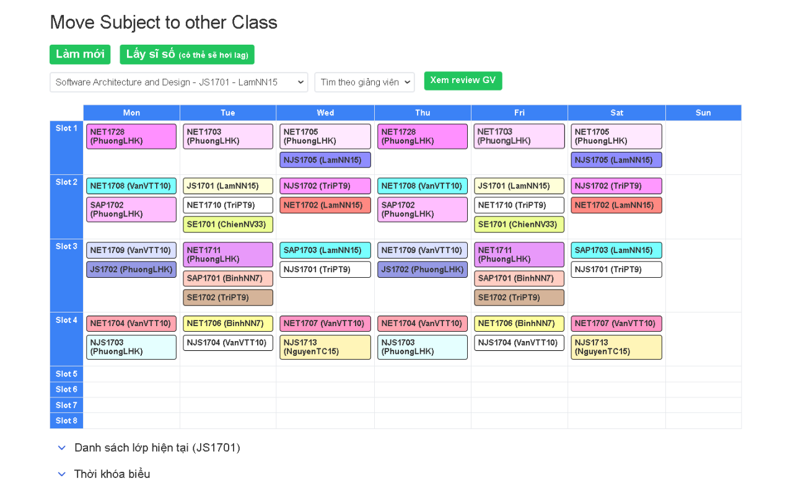

# 📅 FPTU Move Out Class Tool

**Maintainer:** [ruskicoder](https://github.com/ruskicoder)

### 🚀 Tiện ích hỗ trợ sinh viên FPTU - Tối ưu trải nghiệm đổi lớp!

## 🌟 Tính năng nổi bật:

- Xem lớp, lịch học một cách tiện lợi
- Đổi lớp nhanh chóng
- Xem danh sách lớp trực tiếp trong tab trình duyệt
- Xem thời khóa biểu dễ dàng ngay trên tab
- Tìm kiếm lớp theo giảng viên
- Xem review giảng viên (Xin cảm ơn đặc biệt tới vị đại hiệp nào đã làm ra file sheet review giảng viên)
- Xem sĩ số lớp (Đang thử nghiệm)

## 📖 Hướng dẫn sử dụng:

- Truy cập: https://fap.fpt.edu.vn/FrontOffice/Courses.aspx (hoặc vào mục "Move out class" ở trang chủ FAP)
- Chọn môn học bạn muốn đổi
- Đợi hệ thống tải đầy đủ bảng lịch học 
- Click vào lớp bạn muốn chuyển trong bảng 

## ⚠️ Lưu ý:

- Nếu thấy lịch bị cũ, hãy nhấn "Làm mới" ở góc trên cùng để cập nhật lịch học và giảng viên mới nhất nhé! 
- Khuyến khích không nên dùng trong giờ cao điểm

## 🔗 Link tải:

https://chromewebstore.google.com/detail/fptu-move-out-class-tool/bmpjlffjfcpkjhgfjgponabjhkfmjkcb?authuser=0&hl=en

---

_Maintained by [ruskicoder](https://github.com/ruskicoder) ❤️_
